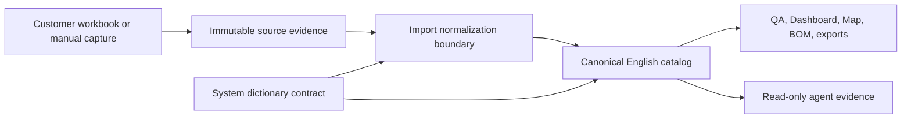

# Canonical English Governance

## Decision

OCI DIS Architect owns one English runtime vocabulary. `OK`, `REVIEW`, and
`PENDING` are the complete QA status contract. Customer files may contain legacy
or localized labels, but those labels are input evidence rather than governed
application values.

This boundary avoids two unsafe extremes: importing arbitrary workbook text into
the domain model, and modifying original evidence to make the catalog appear
clean. The App accepts known source variants, records the normalization event,
and persists only a canonical English value.

## Authority and data flow

The reference seed resolves coded dictionaries by `(category, code)`, not by
display value. PostgreSQL enforces the same identity. `QA_STATUS` is a fixed
system dictionary and cannot be created, renamed, deactivated, or deleted through
the governance API.

## Canonical values

| Domain | Canonical App-owned values |
| --- | --- |
| QA status | `OK`, `REVIEW`, `PENDING` |
| Complexity | `Low`, `Medium`, `High` |
| Initial scope | `Yes`, `No` |
| Lifecycle status | `Already Exists`, `Target State`, `In Review`, `In Progress`, `TBD`, `Duplicate 1` |
| Mapping status | `Under Analysis`, `Mapped`, `Pending` |
| Frequency | `FQ01`–`FQ16` with English display values |

## Migration and evidence policy

Migration `20260815_0062` performs three bounded operations:

1. It converts current catalog and mutable derived projections to English.
2. It collapses duplicate coded dictionary entries and retains the canonical row.
3. It adds a unique `(category, code)` constraint.

`SourceIntegrationRow.raw_data` and historical audit events are intentionally not
rewritten. Their language is part of customer evidence and lineage. UI formatting
may translate a retained source label for presentation, but the raw view remains
traceable to the imported artifact.

## AI and language behavior

The assistant can understand bounded Spanish query and import aliases, but the
App-owned response contract is English. The provider receives an English-only
instruction and Spanish localized knowledge fields are excluded from evidence.
If a provider nevertheless returns Spanish platform narrative, the output gate
rejects it; it is not silently displayed or replaced by an ungoverned fallback.

## Regression controls

- Seed tests assert the exact system values.
- Importer tests prove that legacy labels become English outputs.
- API tests prevent mutations of `QA_STATUS`.
- The migration and seed are validated against the retained PostgreSQL data.
- Source scans classify Spanish literals as input aliases, source headers,
  immutable evidence, or test questions; platform-owned output is prohibited.
- Browser QA verifies the rendered dictionary and a `REVIEW` catalog workflow.
