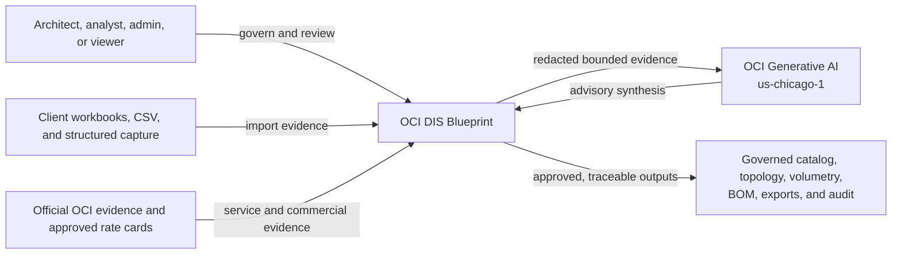
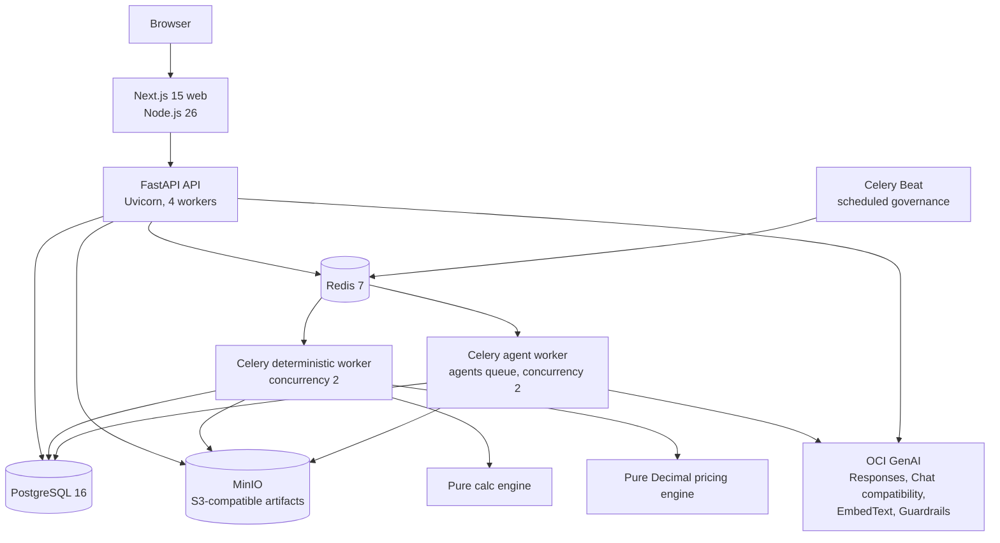
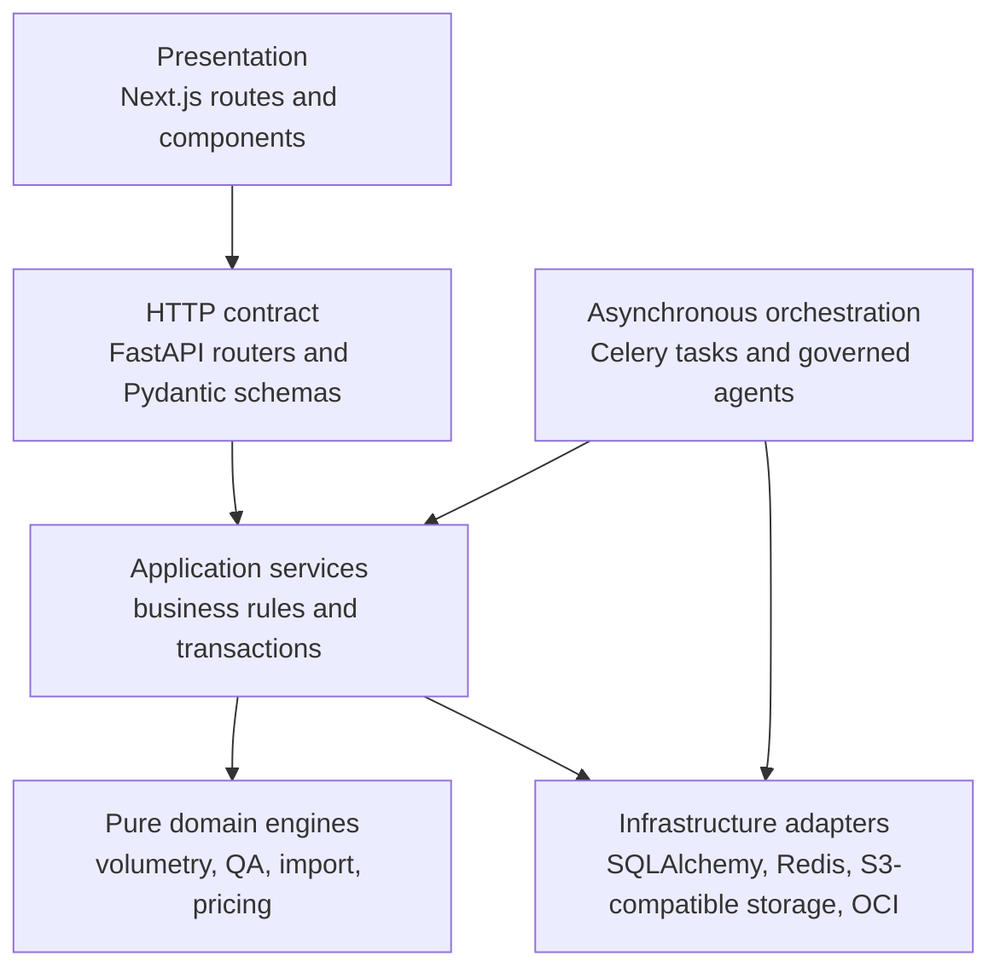
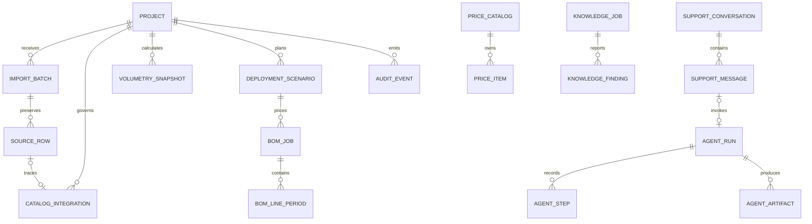
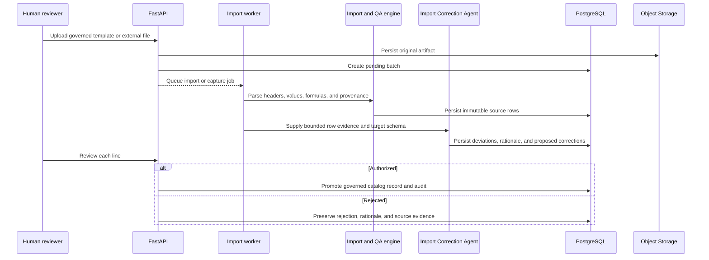
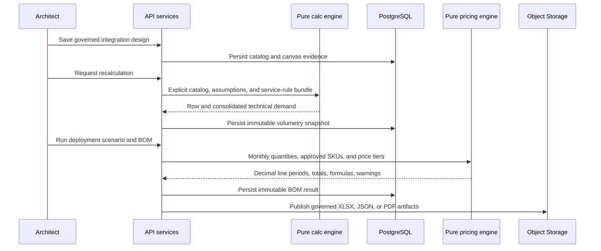
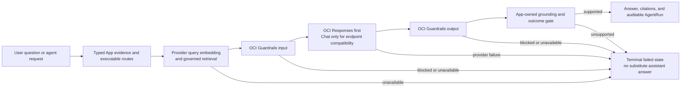
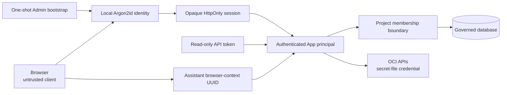

# Current-State Architecture

**Baseline:** working tree through migration `20260814_0057`

**Observed:** 2026-08-14

**Scope:** repository and production-mode Docker Compose runtime

**Deployment status:** implemented locally; OCI production deployment is not yet authorized

## 1. Executive architecture statement

OCI DIS Blueprint is a modular monorepo that converts integration inventory
evidence into a governed catalog, deterministic technical demand, deployment
scenarios, commercial Bills of Materials, and auditable architecture decisions.
The web and API are stateless by intent. PostgreSQL owns business state, Redis
owns asynchronous coordination and bounded operational counters, and an
S3-compatible service owns durable artifacts.

The current eight-service Docker Compose stack is a valid production-mode local
runtime. It is not yet a horizontally scalable OCI production platform. The
container boundaries are reusable for OKE, but OCI IAM integration, shared App Knowledge,
safe probes, queue recovery, singleton scheduling, database connection budgets,
and OCI-native observability remain M77 prerequisites.

## 2. System context

Deterministic application services remain authoritative. OCI Generative AI can
explain evidence and prepare approval-gated proposals, but it does not calculate
volumetry, select authoritative prices, mutate catalog records, or prove that an
execution occurred.

## 3. Runtime containers

| Container | Responsibility | Durable state |
| --- | --- | --- |
| `web` | App Router UI, API projections, route context | None |
| `api` | Typed HTTP contract, authorization checks, service orchestration | None by design |
| `worker` | Import, recalculation, pricing, export, verification, synthetic jobs | None by design |
| `agent-worker` | Governed agent and knowledge tasks on the isolated `agents` queue | None by design; current knowledge publication is an exception |
| `beat` | Periodic service verification, commercial governance, and App Knowledge maintenance | Local schedule file; unsuitable for multiple replicas |
| `db` | Transactional and audit authority | PostgreSQL volume |
| `redis` | Celery broker/backend and fixed-cardinality GenAI telemetry | Redis volume |
| `minio` | Local durable object artifacts | MinIO volume |

The API image is shared by API, deterministic worker, agent worker, and Beat.
The GenAI secret is mounted read-only, copied with mode `0400`, and execution
drops to UID `10001`.

## 4. Logical architecture and ownership

The intended dependency direction is inward: routers remain thin, services own
business transactions, and pure engines accept explicit immutable inputs.
Infrastructure adapters are not permitted inside the calculation or pricing
engines.

### Bounded business domains

| Domain | Authority | Principal outputs |
| --- | --- | --- |
| Project and integration catalog | Projects, imports, immutable source rows, governed catalog rows | Catalog, lineage, QA, topology |
| Integration design | Patterns, dictionaries, Service Products, canvas state | Validated route and recommendations |
| Technical demand | Service rules, workload assumptions, pure calculation engine | Immutable volumetry snapshots |
| Commercial governance | Global OCI catalog, approved price evidence, Product-to-SKU mappings | Immutable BOM jobs and line periods |
| Governed AI | Agent definitions, runs, steps, artifacts, approvals | Advisory decisions and draft proposals |
| App support | Session-scoped conversations, explicit attachments, live App evidence | Grounded assistant answers |
| Knowledge governance | Curated guide, derived manifest, provider embeddings, maintenance findings | Versioned retrieval artifact |
| Audit and artifacts | Audit events and S3-compatible objects | Reproducible evidence and exports |

## 5. Data authority and persistence

The observed runtime contains 65 application tables. The following diagram is a
domain-level model, not a table-by-table physical ERD.

Authority rules:

- Source rows are immutable evidence; corrected catalog rows do not overwrite
  what the client supplied.
- Volumetry snapshots, BOM results, published price evidence, and agent evidence
  are versioned or immutable records.
- Service limits and interoperability rules are normalized runtime authority.
  Assumption sets contain client workload unknowns, not OCI service facts.
- Persistent files are addressed by canonical `s3://bucket/key` references.
- The committed OpenAPI and App Knowledge artifacts are drift-checked generated
  contracts, not independently edited sources of truth.

## 6. Core workflow: intake, reasoning, human governance

The Import Correction Agent is intentionally reasoning-led within a typed
evidence boundary. It compares received data with the App schema, detects
arbitrary interpretation deviations, proposes field mappings and cleaned
values, and explains why human review is required per line. Deterministic
controls still enforce invariants that cannot be delegated to a model: formulas
are not imported as business values, unsupported fields are not materialized,
source evidence remains immutable, required target fields block promotion, and
only a human can authorize or reject the proposed record.

## 7. Technical demand and commercial flow

Technical demand is propagated sequentially through the saved integration
pipeline. Commercial calculation is a later projection: deployment
environments and activation ramps do not change the logical integration
catalog, and pricing never becomes the authority for technical quantity.

## 8. Governed AI and assistant flow

“Chat fallback” is transport compatibility only: if OCI reports that Responses
is unsupported for the configured model endpoint, the same provider may use
Chat Completions. It is not an alternate answer source. In a configured App
Assistant runtime, loss of provider embeddings, query embedding, Guardrails,
inference, or grounding ends the answer visibly as failed. Specialized agents
may preserve their already-computed deterministic evidence brief, but they do
not label it as successful model synthesis.

The current provider artifact contains 282 of 282 Cohere Embed v4 vectors at
512 dimensions. Local 384-dimension vectors exist for deterministic build and
unconfigured test environments; they are not a production answer fallback.

## 9. Current trust boundaries

The installation bootstrap creates exactly one first local Admin and becomes a
no-op on an identical retry; it fails closed when an unexpected user already
exists. The API authenticates an opaque browser session or a bearer API token and then
derives actor identity and role server-side. Legacy actor headers are overwritten
from that principal before existing role checks execute. Project-scoped reads and
writes require a live membership; unauthorized project IDs return `404`. API
tokens are read-only, expiring and revocable, inherit current memberships, and
may narrow—but never expand—the project set or governed evidence capabilities.
Admins manage usernames, App roles, activation, and memberships through User
Management. The assistant UUID separates
browser contexts in addition to the authenticated user boundary.

OCI IAM Identity Domains is not implemented yet. It will be added as another
verified identity for the same App user, leaving local authentication, roles,
memberships, project ownership, and audit intact.

Other current trust controls include:

- OCI GenAI secrets are file-mounted and never part of frontend or OpenAPI
  contracts.
- Guardrails fail closed for configured agent and assistant inference.
- Model tools are typed and allowlisted; no arbitrary SQL, shell, Docker, or URL
  access is exposed.
- Original client artifacts and source rows remain separate from corrected
  working records.
- Audit events capture governed state changes without copying prompt or answer
  content.

## 10. Current scale characteristics

The API uses four Uvicorn worker processes. Each process currently configures a
PostgreSQL pool of 10 connections plus 20 overflow connections. This can reach
120 possible API connections per container before Celery workers and additional
replicas are counted. A global database connection budget and managed-database
limit must therefore precede horizontal scaling.

Celery uses JSON-only messages and separate deterministic and agent consumers,
but explicit late acknowledgement, worker-loss rejection, visibility timeout,
and prefetch policies are not configured. Celery Beat uses a local schedule and
must remain singleton. API startup also performs agent-history pruning, which
would run once per starting API replica. These are recoverability and singleton
ownership gaps, not failures of the current single-stack runtime.

The readiness endpoint verifies migration state and calls
`storage_service.ensure_bucket()`. That call may create a missing bucket, so the
probe is not read-only. It also does not yet verify Redis or the active shared
knowledge hash. This must be corrected before Kubernetes uses it to make traffic
or restart decisions.

## 11. Observed implementation evidence

| Evidence | Observed result |
| --- | --- |
| Docker runtime | Eight expected Compose services running; API, PostgreSQL, Redis, and MinIO healthy |
| Migration state | Current and head at `20260814_0057` |
| Authentication | Local login, forged-header rejection, cross-user `404`, and scoped read-only token lifecycle pass |
| Browser authentication QA | Login, Account, project visibility, token create/revoke, and zero console warnings/errors pass |
| API tests | 341 passed |
| Calculation engine | 99 passed |
| Pricing engine | 35 passed |
| Frontend tests | 142 passed across 24 files |
| Static checks | Ruff, mypy, TypeScript, and ESLint passed |
| Production build | Next.js production build passed |
| App Knowledge | Deterministic drift check passed; source hash prefix `f0459e5b68fe`; 307/307 OCI provider vectors at 512 dimensions |

Focused non-destructive browser authentication QA was rerun against the retained
data stack. Destructive canonical browser cleanup flows still require an isolated
release environment before an OCI release.

## 12. Current limitations

The following are explicitly **not implemented production claims**:

1. OCI IAM as an additional verified identity provider and token-derived group mapping.
2. OKE manifests, Helm releases, Terraform modules, or OCI provisioned runtime.
3. Shared atomic App Knowledge publication across replicas.
4. Read-only comprehensive Kubernetes readiness.
5. Globally budgeted PostgreSQL connections.
6. Celery delivery semantics validated under worker termination.
7. Lease-owned scheduled work and maintenance.
8. OCI-native logs, metrics, traces, dashboards, alarms, and synthetic monitors.
9. A decided cross-region disaster-recovery topology.

The governed plan for these gaps is
[OCI OKE Horizontal-Scale Deployment Plan](./oci-oke-horizontal-scale-deployment-plan.md).
