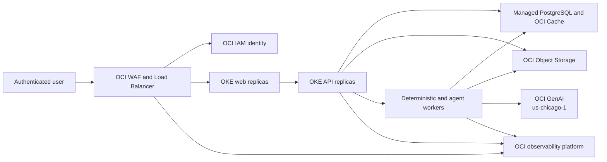
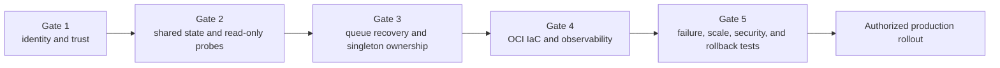

# Current vs. Target Architecture Roadmap

**Primary target region:** Mexico Central (Queretaro), `mx-queretaro-1`

**Remote governed dependency:** OCI Generative AI, `us-chicago-1`

**Target milestone:** M77

**Current authorization:** planning and repository implementation only; no OCI resource creation

## Capability comparison

| Concern | Current, implemented state | Target state | Gap / exit evidence |
| --- | --- | --- | --- |
| Runtime | Eight production-mode Docker Compose services on one Docker host | OKE Deployments and governed Jobs | Helm/Terraform render, rollout, rollback, and smoke evidence |
| Web and API scale | Stateless by intent; API has four local Uvicorn workers | At least two replicas with HPA and disruption budgets | Replica-loss and rolling-deploy tests |
| Identity | Caller-provided `X-Actor-*` headers; support UUID isolation | OCI IAM OIDC/JWT subject and token-derived roles | Forged headers rejected; cross-user access tests |
| Database | PostgreSQL 16 container; per-process pool 10 + 20 overflow | Managed PostgreSQL and an explicit global connection budget | Load test stays below configured connection ceiling |
| Broker/cache | Redis 7 container | OCI Cache with TLS and recovery policy | Broker interruption and reconnect tests |
| Artifacts | MinIO through S3-compatible adapter | OCI Object Storage with workload identity | Versioning, retention, access, and failure tests |
| App Knowledge | Committed provider vectors; scheduled publication to local `/tmp` | Immutable Object Storage artifact plus transactional active hash | Replica convergence and stale/hash-mismatch tests |
| Import and correction | Reasoning-led agent proposals, deterministic formula/schema controls, human promotion | Same domain contract on OKE | Parallel import, retry, idempotency, and audit tests |
| Deterministic jobs | Dedicated Celery worker | Horizontally scaled worker with explicit delivery semantics | Worker-kill, retry, duplicate-delivery tests |
| Agent jobs | Isolated `agents` queue | Scaled agent worker with bounded concurrency and OCI quota controls | Provider throttle and worker-loss tests |
| Scheduling | One Celery Beat container with local schedule | Lease-owned CronJobs or one elected scheduler | Duplicate scheduler cannot execute the same logical run |
| Maintenance | API entrypoint prunes agent history | Dedicated idempotent scheduled maintenance | Concurrent-start test produces one safe result |
| Readiness | Migration and object storage check; may create bucket | Read-only database, Redis, Object Storage, and active-knowledge checks | Probe cannot mutate; each failed dependency returns not-ready |
| Inference | OCI GenAI in Chicago, Guardrails, provider metrics, no assistant answer fallback | Same dependency with network policy, alarms, quota, and SLOs | Cross-region latency/failure and no-fallback evidence |
| Observability | Container logs and fixed-cardinality GenAI counters | OCI Logging, Monitoring, APM, OpenTelemetry, alarms, synthetics, budgets | Trace correlation, dashboards, alarm tests, retention validation |
| Secrets | Read-only local secret file copied mode `0400` | OCI Vault and workload identity | Rotation without image rebuild or log exposure |
| Release | Canonical CI validates code and images | OCIR promotion, signed artifacts, Helm/Terraform, controlled rollout | Provenance, scan, deploy, smoke, and rollback record |
| Availability | Single host | Three Fault Domains in Queretaro | Fault-Domain spread and pod/node disruption tests |
| Disaster recovery | Not defined | Decision required | RPO/RTO and regional recovery ADR approved |

## Target request flow

The diagram is a target-state relationship, not a statement that these OCI
resources already exist.

## Delivery sequence

### Gate 1 — identity and trust

- Implement OIDC/JWT validation and subject-to-role mapping.
- Reject externally supplied actor identity and role headers.
- Bind App Assistant conversations to the authenticated subject while
  preserving opaque conversation identifiers.
- Validate project, commercial, agent, and admin authorization at the service
  boundary.

### Gate 2 — shared state and probes

- Move App Knowledge publication to immutable Object Storage versions.
- Store the active source hash and version pointer transactionally.
- Remove bucket creation from readiness and provision it through IaC.
- Add Redis and active-knowledge checks.
- Define the total PostgreSQL connection budget across all processes and
  replicas.

### Gate 3 — recoverable asynchronous work

- Decide late acknowledgement, worker-loss, visibility-timeout, and prefetch
  policy for each queue.
- Prove task idempotency under redelivery.
- Replace per-API-start pruning with a dedicated scheduled job.
- Give each scheduled governance workflow one lease owner or Kubernetes
  CronJob contract.

### Gate 4 — OCI platform and observability

- Provision network, OKE, managed data services, Object Storage, Vault, OCIR,
  and IAM from reviewed Terraform.
- Deploy OCI Logging, Monitoring, APM, OpenTelemetry collectors, dashboards,
  alarms, Health Checks, synthetic journeys, budgets, and retention policies.
- Keep primary application, data, and observability resources in Queretaro.
- Permit only governed TLS egress to the Chicago inference and Guardrails
  endpoints.

### Gate 5 — release proof

- Validate pod, node, broker, database, object storage, and Chicago provider
  failure paths.
- Execute isolated browser E2E and retained synthetic reference-project QA.
- Validate capacity, connection ceilings, HPA behavior, disruption budgets,
  secret rotation, audit continuity, and rollback.
- Record `fallback_used = false` for App Assistant release cases.

## Planned OCI observability minimum

| Layer | Required signals |
| --- | --- |
| User edge | TLS, WAF, load balancer, response class, latency, synthetic journey |
| Web/API | request rate, error rate, duration, saturation, readiness, deployment version |
| PostgreSQL | connections, transactions, locks, replication/backup health, storage |
| Redis/Celery | queue depth, oldest age, retries, failures, worker heartbeats, task duration |
| Object Storage | access failures, latency, version activation, lifecycle events |
| GenAI | request totals, retry classes, Guardrails outcomes, Responses compatibility, terminal degradation, cross-region latency |
| Domain | import outcomes, QA distribution, recalculation/BOM terminal states, knowledge hash convergence |
| Security/audit | authentication failures, authorization denials, secret rotation, privileged changes |

Prompts, answers, client records, credentials, actor IDs, session IDs, project
IDs, and integration IDs are excluded from telemetry dimensions and logs.

## Explicit future decisions

M77 does not silently decide:

- cross-region disaster recovery, RPO, or RTO;
- managed PostgreSQL product and topology until tenancy capability is verified;
- public versus private OKE endpoint model;
- OCI APM and Logging Analytics availability and exact sizing in Queretaro;
- release environment count and tenancy/compartment boundaries;
- acceptable Chicago dependency latency and error SLO.

These decisions require current tenancy evidence and explicit authorization.
The detailed resource assumptions and observability estimates are in
[OCI OKE Horizontal-Scale Deployment Plan](./oci-oke-horizontal-scale-deployment-plan.md).
