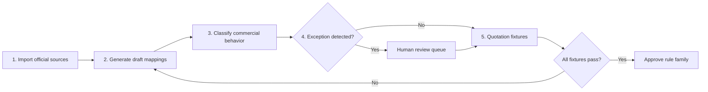

# OCI Full Catalog Commercial Coverage Plan

## Status

**Complete with a governed global catalog release.** This work extends the completed
DIS-specific commercial coverage from M50 to the complete public OCI catalog. Release
`commercial-20260720043236` records a terminal disposition for all 1,182 candidates:
229 are quote-ready and 953 are truthfully blocked with governed reasons. The App BOM
allowlist remains 27 of 32 mapped SKUs and excludes five unresolved dependencies.
Global coverage means that every candidate is governed; it does not claim that every
public SKU is eligible for quotation.
The independent review and known deviations are recorded in
`docs/audits/m51-commercial-catalog-deviations.md`.

## Objective

Provide governed handling for every product returned by the official OCI public
pricing endpoints while preserving the existing rule that deterministic services,
not an LLM, own quantities, rates, formulas, and totals.

Full coverage means that every public SKU is:

- ingested without loss, with its source hash and retrieval timestamp;
- searchable by service category, product, metric, part number, edition, and license;
- assigned a governed commercial disposition: directly metered, included,
  dependent, externally rated, or blocked pending explicit input;
- evaluated by the correct price type, tier, increment, minimum, aggregation,
  proration, Free Tier, and dependency rules;
- traceable through Library, Pricing, BOM, exports, assistant evidence, and audit;
- prevented from publication whenever required commercial evidence is absent.

Full coverage does not mean inventing private contract rates, BYOL eligibility,
entitlements, or customer quantities. Those remain explicit review inputs.

## Measured Baseline

Measured on 2026-07-20 from the latest persisted official source set and Oracle
Localizable Price List import:

| Inventory | Public OCI source | Current approved App state |
| --- | ---: | ---: |
| Products | 674 | 674 persisted in the atomic structured source set |
| Documentary records | Source workbook | 1,163 normalized records from 1,182 candidates |
| Metrics | 234 | 234 persisted in the atomic structured source set |
| Product presets | 118 | 118 persisted as advisory composition evidence |
| Documentary exceptions | Source workbook | 1,149 initially generated; 1,121 currently open after governed decisions |
| Global catalog candidates | 1,182 | 1,182 terminal dispositions: 229 quote-ready and 953 blocked |
| Approved App SKU mappings | 32 mapped SKUs | 27 included in the approved release |
| Excluded App SKU mappings | 32 mapped SKUs | 5 blocked dependencies retained explicitly |

Official sources:

- [Products](https://www.oracle.com/a/ocom/docs/cloudestimator2/data/products.json)
- [Metrics](https://www.oracle.com/a/ocom/docs/cloudestimator2/data/metrics.json)
- [Product presets](https://www.oracle.com/a/ocom/docs/cloudestimator2/data/productpresets.json)
- Oracle PaaS and IaaS Public Cloud Localizable Price List, retained as an
  immutable governed document snapshot.
- Oracle PaaS and IaaS Supplement, retained as an immutable governed document
  snapshot and linked to the corresponding Price List release.

## Field-Level Source Authority

Source precedence is resolved per field. No source is globally authoritative for
all commercial semantics.

| Governed field | Authoritative source | Required treatment |
| --- | --- | --- |
| Customer price | Approved contractual rate card | Overrides the public rate only; it must not replace public terms, metric semantics, or dependencies. |
| Public PAYG price and tiers | OCI public pricing API | Persist the exact decimal values, currency, tier boundaries, source hash, and retrieval timestamp. |
| Commitment term type and value | Localizable Price List | Store `Annual Commitment`, `Annual Flex`, `Monthly Flex`, or another explicit workbook label as a typed term; never collapse them into one annual scalar. |
| Metric minimum and billing guidance | Localizable Price List | Preserve the minimum with its scope and source evidence; parse deterministic phrases only through approved rules. |
| Entitlements and prerequisites | Supplement | Persist typed relationships, resolution status, confidence, and source evidence. A name-only dependency remains unresolved. |
| Product identity, price type, decimal allowance, availability | `products.json` | Reconcile by exact source identity and part number; disagreement creates an exception. |
| Metric identity and display semantics | `metrics.json` | Preserve source metric IDs and labels; metric text alone does not define the pricing formula. |
| Estimator composition hints | `productpresets.json` | Advisory input for candidate generation only; a preset cannot approve a mapping or dependency. |

Blank, `-`, `Always Free`, and `See Additional Information` are distinct source
states. None of them is normalized to numeric zero. Any conflict among field-level
authorities creates a blocking exception instead of being resolved by source order.

## Governed Commercial Data Contract

Every normalized SKU term must retain:

- exact part number, product identity, metric identity, currency, and source release;
- separate public PAYG and typed commitment terms, including `Annual Commitment`,
  `Annual Flex`, and `Monthly Flex` when present;
- semantic price state for numeric, blank, `-`, `Always Free`, and
  `See Additional Information` source values;
- one or more typed constraints rather than scalar `minimum` or `increment` fields;
- source sheet, row, cell or field reference, document hash, parser version, and
  review status for every accepted commercial assertion.

Each typed constraint includes:

- `constraint_type`: minimum capacity, purchase increment, billing granularity,
  minimum duration, tier boundary, aggregation, proration, or another approved type;
- `scope`: capacity, time, storage, backup, request, message, tenant, subscription,
  environment, or other explicit governed scope;
- decimal value and unit when numeric;
- applicability predicates for edition, license, BYOL, region, environment, or SKU;
- deterministic extraction rule or explicit human decision;
- evidence references and review state.

For example, the `2` on B95701 is a minimum ECPU capacity, not two monthly
ECPU-hours. B95754 may contain distinct database-storage and backup increments;
those constraints must remain separate and cannot overwrite one another.

Every entitlement or prerequisite relationship includes source and target identity,
relationship type, resolution status, confidence, and evidence. Exact target part
numbers may resolve deterministically. Name-only targets remain blocked until an
audited human decision identifies the target or records a truthful unresolved state.

## Automation And Review Boundary

The following operations are defensible as deterministic automation:

- exact part-number and source-ID reconciliation;
- decimal price extraction without binary floating-point conversion;
- numeric metric-minimum extraction with explicit scope;
- structured `allowDecimalQty`, availability, and price-type ingestion;
- approved exact-phrase extraction for billing granularity and minimum duration;
- explicit part-number dependency linking;
- exact metric and price reconciliation across official sources;
- draft classification, candidate generation, and fixture execution.

The following require human review and an audit decision:

- BYOL eligibility and customer entitlement;
- name-only dependencies and prerequisites;
- `See above`, `OR equivalent`, `See Additional Information`, and continuation rows;
- prose containing multiple constraints that cannot be separated by an approved rule;
- commitment eligibility, discount thresholds, private rates, and regional eligibility;
- conflicting prices, metrics, product identities, or relationship evidence;
- any new commercial family or low-confidence candidate.

OCI Generative AI may summarize evidence, identify likely conflicts, and propose a
review order. It cannot create authoritative quantities, resolve a dependency,
select a commercial term, approve a mapping, or close an exception.

## Mandatory Execution Strategy

The following five stages are ordered, mandatory, and release-gated. An
implementation may optimize work inside a stage, but it must not skip, reorder,
or merge away the evidence and approval boundary between stages.

### Stage 1 — Import official structured and documentary sources

**Inputs**

- Products from the official `products.json` endpoint.
- Metric definitions from the official `metrics.json` endpoint.
- Product-to-category and SKU presets from the official `productpresets.json` endpoint.
- Localizable Price List and Supplement workbook releases.

**Required behavior**

- Fetch the three structured sources as one synchronization unit and bind them to
  explicitly selected immutable Price List and Supplement document snapshots.
- Validate schema, build metadata, source completeness, pagination flags, and
  selected-currency availability before modifying governed state.
- Normalize source records into immutable raw and queryable catalog snapshots while
  retaining original IDs, part numbers, service IDs, metric IDs, price types,
  tiers, availability, billing model, currency rows, and source hashes.
- Atomically publish the new source snapshot only after all three inputs validate.
  A partial or malformed refresh must leave the previous approved snapshot active.
- Produce a drift manifest for added, changed, retired, and structurally ambiguous records.
- Parse workbook values into typed terms, constraints, relationships, and evidence
  while preserving all nonnumeric source states and exact source locations.

**Gate 1**

The stored counts, identifiers, selected-currency price rows, document identities,
and source hashes must reconcile exactly with the downloaded payloads and approved
workbook snapshots. No mapping generation starts from a partial or unbound release.

### Stage 2 — Generate initial mappings by price family and metric

**Inputs**

- The approved source snapshot from Stage 1.
- Existing approved rule-family templates and historical mappings.

**Required behavior**

- Group SKUs by price type, metric, service category, billing model, tier shape,
  and compatible commercial predicates.
- Generate versioned **draft** mappings containing formula family, metric identity,
  quantity unit, typed repeatable constraints, aggregation, proration, tier behavior,
  availability, edition/license predicates, relationships, and evidence references.
- Reuse a rule family only when its formula and commercial semantics are equivalent;
  similar product names alone are insufficient.
- Record generator version, source snapshot, confidence, and the fields that caused
  the family assignment.

**Gate 2**

Every source SKU must have exactly one draft mapping candidate or an explicit
`unmapped_exception` record. Generated mappings can never be approved implicitly.

### Stage 3 — Classify products automatically

Each generated product and SKU must receive one governed disposition:

- `direct_metered`: the SKU has a deterministic public meter and formula;
- `included_non_billable`: the product remains visible but contributes zero amount;
- `dependent_entitlement`: price or availability belongs to another product,
  edition, or contract entitlement;
- `external_rate_card`: a public API row is insufficient and an authorized rate
  card or contractual source is required;
- `blocked_input_required`: quantity, edition, license, BYOL, region, dependency,
  or other evidence is missing or ambiguous.

Classification must be rule-based and reproducible. OCI Generative AI may explain
or rank evidence but must not assign the authoritative disposition.

**Gate 3**

Every SKU has a classification, publication policy, required-input contract,
confidence score, and source evidence. Only deterministic high-confidence cases
may continue directly to fixtures; all others enter Stage 4.

### Stage 4 — Mark exceptions for human review

The factory must create a review item when it finds:

- conflicting or missing product presets, metrics, tiers, or documentation;
- BYOL, edition, entitlement, private-rate, region, or availability ambiguity;
- a new formula family or unsupported price/metric combination;
- inconsistent quantity units, tier boundaries, proration, or Free Tier evidence;
- a low-confidence mapping, classification, dependency, or product identity;
- source drift affecting an already approved family.
- unresolved relationship targets, ambiguous constraint scopes, or source values
  such as `See Additional Information` that lack an approved interpretation.

The review item must include the proposed decision, affected SKUs, evidence,
commercial impact, fixture plan, and accept/reject rationale. Until reviewed, the
SKU remains visible but blocked from quote-ready publication.

**Gate 4**

Every exception has an explicit human decision or remains truthfully blocked. An
LLM response, successful source fetch, or matching product name cannot close it.

### Stage 5 — Execute quotation fixtures before family approval

Each rule family must have deterministic fixtures covering:

- zero, minimum, below-boundary, exact-boundary, and above-boundary quantities;
- every paid tier and open-ended tier transition;
- proration, non-proration, aggregation window, and quantity increments;
- included, dependent, external-rate, and blocked-input behavior;
- edition, license, BYOL, region, and availability predicates where applicable;
- monthly ramps, environment separation, Free Tier allocation, and immutable provenance;
- agreement between API result, pricing engine, BOM line, monthly periods, and export.
- source-semantic preservation for blank, `-`, `Always Free`, and
  `See Additional Information` values.

Fixtures must use explicit expected quantities, price items, unit prices, formulas,
warnings, and totals. Snapshot tests without independent expected values are not
sufficient approval evidence.

**Gate 5**

A rule family becomes `approved` only when all fixtures pass, no unresolved
exception applies, source provenance is complete, and the approval is audited.
Any source or rule change creates a new draft version and reruns the affected fixtures.

### Mandatory acceptance fixtures

The initial release cannot be approved without these SKU-specific fixtures:

1. `B95701` extracts PAYG `0.336`, Annual Commitment `0.336`, `ECPU Per Hour`,
   minimum capacity `2`, per-second billing, and a 60-second minimum duration.
2. `B95701` remains blocked from quote-ready publication until its Exadata Storage
   prerequisite has an approved, resolved target.
3. `B95703` requires an explicit audited BYOL eligibility decision.
4. `B95754` preserves database-storage and backup increments as separate typed constraints.
5. `B88206` does not interpret a continuation row as a price tier or a second SKU.
6. `B92072` preserves prorated fractional million API calls and does not force
   whole-number usage when the official metric permits decimals.
7. `B92598` requires explicit workspace hours and never receives a universal
   default of `744` hours.
8. `B93306` validates one-minute increments and tenant-scoped allowances separately.
9. Every tiered family validates zero, below-minimum, exact-boundary, and
   above-boundary quantities with independent expected values.
10. Any API, Price List, Supplement, products, or metrics disagreement creates a
    blocking exception.
11. Generated candidates remain drafts until their fixtures pass and approval is audited.
12. BOM publication fails when any line lacks approved price, term, mapping,
    relationship, rule, or evidence coverage required by that line.

### No-deviation rules

- Field-level authority is resolved before generation. Import precedes generation;
  generation precedes classification; classification
  precedes exception disposition; fixtures precede approval.
- Generated records always start as drafts and never replace active governance in place.
- Missing evidence produces a blocked state, never a guessed default.
- LLMs remain advisory and cannot calculate totals, approve mappings, or close exceptions.
- Approval is versioned, auditable, reversible, and tied to one immutable source snapshot.
- Release coverage is measured from source SKU to final disposition and from BOM
  line to approved price evidence; aggregate percentages cannot hide omitted records.
- Existing published BOMs retain their immutable release provenance; activating a
  new commercial release never mutates historical quantities, rates, or totals.

## Recommended Implementation

### 1. Complete source synchronization

- Refresh all three public sources atomically.
- Reconcile source counts, currencies, tiers, availability, billing model, and hashes.
- Retain the previous approved snapshot when any source is incomplete or malformed.
- Add an explicit source-drift report for added, changed, and retired SKUs.

### 2. Commercial Product Factory

- Generate draft Service Products, metric families, SKU mappings, and policies from
  products, presets, and metrics rather than hand-authoring hundreds of records.
- Group equivalent SKUs behind reusable commercial rule families.
- Preserve product-specific predicates for edition, license, BYOL, region,
  availability, and dependency choices.
- Require review before generated governance becomes approved.

### 3. Universal deterministic pricing rules

- Cover `HOUR`, `HOUR_UTILIZED`, `MONTH`, `DAY`, and `PER-ITEM` price types.
- Handle all paid tiers, exact range boundaries, decimal usage, increments,
  minimums, proration, and aggregation windows.
- Keep customer demand, canonical billable quantity, and optional planning envelope
  separate in immutable provenance.
- Never infer private discounts, contractual allowances, or eligibility.

### 4. App-wide product experience

- Add full-catalog search, filters, product families, editions, metrics, and SKUs to
  Library and Pricing without overwhelming the DIS architecture workflow.
- Let BOM expose only products selected by the architecture or explicitly added to
  a deployment scenario.
- Extend assistant and agent evidence with bounded catalog lookup and citations;
  deterministic services remain authoritative.
- Preserve responsive light/dark behavior and accessible keyboard workflows.

### 5. Validation and release governance

- Add fixtures for every price type and every generated rule family.
- Validate all tier boundaries, zero-cost lines, dependency blocks, optional SKUs,
  and explicit-input paths.
- Compare imported counts and hashes with the official source on every sync.
- Run API, pricing engine, frontend, OpenAPI, migration, browser E2E, export,
  security, and production image gates before release.
- Require a final OCI Pricing subject-matter review for ambiguous commercial rules.

## Autonomous Delivery Estimate

Estimated Codex execution time under the approach above: **8–12 working days**,
or approximately **60–90 hours of effective implementation and validation**.

| Window | Expected result |
| --- | --- |
| Days 1–2 | Complete source sync, reconciliation, and drift reporting |
| Days 3–5 | Commercial Product Factory and generated governance drafts |
| Days 6–7 | Price families, tiering, proration, Free Tier, BYOL, and dependencies |
| Days 8–9 | Library, Pricing, BOM, exports, assistant, and agent integration |
| Days 10–12 | Exception audit, regression suites, browser QA, and documentation |

A first usable catalog-wide version should be available after 48–72 hours. The
production target is approximately two calendar weeks when followed by a focused
one-to-two-day OCI Pricing review.

## Acceptance Criteria

### Phase 2A — read-only product taxonomy

The App exposes the already-captured commercial SKU taxonomy through
`GET /api/v1/pricing/product-catalog` and its paginated product-detail route.
Products are grouped by the final `product_hierarchy` value and categorized by
the preceding value. Historical rows without a hierarchy remain visible by
falling back to their captured `display_name` and `service_category`; the API
does not rewrite source identity.

The list response remains bounded to the requested page and summarizes PAYG
prices only from the latest approved USD snapshot. Product detail lazily loads
one bounded SKU page with captured terms, latest candidate classification, and
the existence of a BOM mapping. This projection is read-only: it does not alter
mapping, policy, capability, scenario, pricing, approval, or BOM behavior.

- [x] The latest official products, presets, and metrics sources complete one atomic sync.
- [x] Approved Price List and Supplement snapshots are immutable, hashed, and bound
      to the structured source release through field-level authority.
- [x] Source and stored counts reconcile exactly for the selected currency.
- [x] Commercial term types, semantic price states, typed constraints, and
      relationship resolution states persist without lossy scalar normalization.
- [x] Every public SKU has an approved commercial disposition or a truthful blocked state.
- [x] Every service category has governed ownership, evidence, and publication policy.
- [x] All five public price types and every tier boundary are covered by deterministic tests.
- [x] No product becomes quote-ready solely because an LLM generated a description or mapping.
- [x] BOM publication remains blocked below 100% line-level mapping and price coverage for its pinned release scope.
- [x] Library, Pricing, BOM, exports, assistant, and agents expose consistent product identity.
- [x] Migrations, backend, engines, frontend, OpenAPI, E2E, visual, audit, and image gates pass.
- [x] OCI Pricing review records approval or an explicit exception for ambiguous rule families.
- [x] All twelve mandatory App-scope SKU and publication fixture classes pass with independent expected values.
- [x] Every release gate above is satisfied and the independent deviation audit
      has no unresolved production-blocking item for the governed global baseline.

## Completion Evidence

- Global release: `commercial-20260720043236`.
- Review actor: `codex-m51-global-catalog-review`.
- Catalog dispositions: 1,182 terminal, 229 quote-ready, 953 blocked, zero pending.
- App BOM mappings: 27 enabled and five explicitly excluded.
- Catalog exceptions: 1,121 remain visible for remediation; they do not become
  quote-ready merely because the global disposition pass is complete.
- A prior one-SKU global release was superseded after stale generator evidence was
  detected; the corrective finalization revalidated every candidate through its
  deterministic rule and fixture before recording a decision.
- Validation: 200 API, 55 calc-engine, 35 pricing-engine, and 94 frontend tests;
  Ruff, mypy, TypeScript, ESLint, Node 26 production build, OpenAPI, npm audit,
  17 browser E2E tests, responsive dark-mode inspection, production Docker health,
  and zero-critical/high production-image gates passed. The API image has no known
  findings; the web image retains one medium BusyBox finding with no fixed Alpine
  package available and is recorded as a monitored base-image exception.

## Risks And Controls

- Public SKUs can appear or retire between releases. Hash-based drift and generated
  draft governance prevent silent behavioral changes.
- The public API exposes prices but does not prove customer entitlement. Explicit
  input and dependency states prevent false quote readiness.
- Product names and metrics are not sufficient to infer all commercial formulas.
  Rule-family confidence and SME exceptions remain first-class evidence.
- Presenting 668 SKUs directly in architecture workflows would add noise. Full
  catalog discovery remains separate from the project-scoped product footprint.
