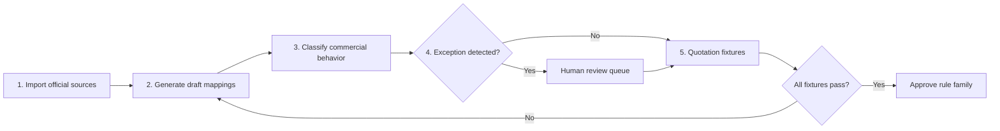

# OCI Full Catalog Commercial Coverage Plan

## Status

Planned backlog item. This work extends the completed DIS-specific commercial
coverage from M50 to the complete public OCI Cloud Estimator product catalog.
It is not part of the currently validated production scope.

## Objective

Provide governed handling for every product returned by the official OCI public
pricing endpoints while preserving the existing rule that deterministic services,
not an LLM, own quantities, rates, formulas, and totals.

Full coverage means that every public SKU is:

- ingested without loss, with its source hash and retrieval timestamp;
- searchable by service category, product, metric, part number, edition, and license;
- assigned a governed commercial disposition: directly metered, included,
  dependent, externally rated, or blocked pending explicit input;
- evaluated by the correct price type, tier, increment, minimum, aggregation,
  proration, Free Tier, and dependency rules;
- traceable through Library, Pricing, BOM, exports, assistant evidence, and audit;
- prevented from publication whenever required commercial evidence is absent.

Full coverage does not mean inventing private contract rates, BYOL eligibility,
entitlements, or customer quantities. Those remain explicit review inputs.

## Measured Baseline

Measured on 2026-07-15 against public Cloud Estimator build `428`, dated
2026-07-01:

| Inventory | Public OCI source | Current approved App state |
| --- | ---: | ---: |
| Unique SKUs | 668 | 652 ingested |
| USD price rows, including tiers | 728 | 712 ingested |
| Service categories | 123 | 108 ingested |
| Metrics | 234 | Partially governed |
| Product presets | 117 | Reference ingestion only |
| Tiered USD SKUs | 55 | Generic tier storage available |
| Governed Service Products | 123 potential categories | 20 DIS products |
| Approved SKU mappings | 668 potential SKUs | 34 mappings across 32 SKUs |

Official sources:

- [Products](https://www.oracle.com/a/ocom/docs/cloudestimator2/data/products.json)
- [Metrics](https://www.oracle.com/a/ocom/docs/cloudestimator2/data/metrics.json)
- [Product presets](https://www.oracle.com/a/ocom/docs/cloudestimator2/data/productpresets.json)

## Mandatory Execution Strategy

The following five stages are ordered, mandatory, and release-gated. An
implementation may optimize work inside a stage, but it must not skip, reorder,
or merge away the evidence and approval boundary between stages.

### Stage 1 — Import products, metrics, and presets

**Inputs**

- Products from the official `products.json` endpoint.
- Metric definitions from the official `metrics.json` endpoint.
- Product-to-category and SKU presets from the official `productpresets.json` endpoint.

**Required behavior**

- Fetch all three sources as one synchronization unit.
- Validate schema, build metadata, source completeness, pagination flags, and
  selected-currency availability before modifying governed state.
- Normalize source records into immutable raw and queryable catalog snapshots while
  retaining original IDs, part numbers, service IDs, metric IDs, price types,
  tiers, availability, billing model, currency rows, and source hashes.
- Atomically publish the new source snapshot only after all three inputs validate.
  A partial or malformed refresh must leave the previous approved snapshot active.
- Produce a drift manifest for added, changed, retired, and structurally ambiguous records.

**Gate 1**

The stored counts, identifiers, selected-currency price rows, and source hashes
must reconcile exactly with the downloaded source payloads. No mapping generation
starts from a partial snapshot.

### Stage 2 — Generate initial mappings by price family and metric

**Inputs**

- The approved source snapshot from Stage 1.
- Existing approved rule-family templates and historical mappings.

**Required behavior**

- Group SKUs by price type, metric, service category, billing model, tier shape,
  and compatible commercial predicates.
- Generate versioned **draft** mappings containing formula family, metric identity,
  quantity unit, increment, minimum, aggregation, proration, tier behavior,
  availability, edition/license predicates, and evidence references.
- Reuse a rule family only when its formula and commercial semantics are equivalent;
  similar product names alone are insufficient.
- Record generator version, source snapshot, confidence, and the fields that caused
  the family assignment.

**Gate 2**

Every source SKU must have exactly one draft mapping candidate or an explicit
`unmapped_exception` record. Generated mappings can never be approved implicitly.

### Stage 3 — Classify products automatically

Each generated product and SKU must receive one governed disposition:

- `direct_metered`: the SKU has a deterministic public meter and formula;
- `included_non_billable`: the product remains visible but contributes zero amount;
- `dependent_entitlement`: price or availability belongs to another product,
  edition, or contract entitlement;
- `external_rate_card`: a public API row is insufficient and an authorized rate
  card or contractual source is required;
- `blocked_input_required`: quantity, edition, license, BYOL, region, dependency,
  or other evidence is missing or ambiguous.

Classification must be rule-based and reproducible. OCI Generative AI may explain
or rank evidence but must not assign the authoritative disposition.

**Gate 3**

Every SKU has a classification, publication policy, required-input contract,
confidence score, and source evidence. Only deterministic high-confidence cases
may continue directly to fixtures; all others enter Stage 4.

### Stage 4 — Mark exceptions for human review

The factory must create a review item when it finds:

- conflicting or missing product presets, metrics, tiers, or documentation;
- BYOL, edition, entitlement, private-rate, region, or availability ambiguity;
- a new formula family or unsupported price/metric combination;
- inconsistent quantity units, tier boundaries, proration, or Free Tier evidence;
- a low-confidence mapping, classification, dependency, or product identity;
- source drift affecting an already approved family.

The review item must include the proposed decision, affected SKUs, evidence,
commercial impact, fixture plan, and accept/reject rationale. Until reviewed, the
SKU remains visible but blocked from quote-ready publication.

**Gate 4**

Every exception has an explicit human decision or remains truthfully blocked. An
LLM response, successful source fetch, or matching product name cannot close it.

### Stage 5 — Execute quotation fixtures before family approval

Each rule family must have deterministic fixtures covering:

- zero, minimum, below-boundary, exact-boundary, and above-boundary quantities;
- every paid tier and open-ended tier transition;
- proration, non-proration, aggregation window, and quantity increments;
- included, dependent, external-rate, and blocked-input behavior;
- edition, license, BYOL, region, and availability predicates where applicable;
- monthly ramps, environment separation, Free Tier allocation, and immutable provenance;
- agreement between API result, pricing engine, BOM line, monthly periods, and export.

Fixtures must use explicit expected quantities, price items, unit prices, formulas,
warnings, and totals. Snapshot tests without independent expected values are not
sufficient approval evidence.

**Gate 5**

A rule family becomes `approved` only when all fixtures pass, no unresolved
exception applies, source provenance is complete, and the approval is audited.
Any source or rule change creates a new draft version and reruns the affected fixtures.

### No-deviation rules

- Import precedes generation; generation precedes classification; classification
  precedes exception disposition; fixtures precede approval.
- Generated records always start as drafts and never replace active governance in place.
- Missing evidence produces a blocked state, never a guessed default.
- LLMs remain advisory and cannot calculate totals, approve mappings, or close exceptions.
- Approval is versioned, auditable, reversible, and tied to one immutable source snapshot.
- Release coverage is measured from source SKU to final disposition and from BOM
  line to approved price evidence; aggregate percentages cannot hide omitted records.

## Recommended Implementation

### 1. Complete source synchronization

- Refresh all three public sources atomically.
- Reconcile source counts, currencies, tiers, availability, billing model, and hashes.
- Retain the previous approved snapshot when any source is incomplete or malformed.
- Add an explicit source-drift report for added, changed, and retired SKUs.

### 2. Commercial Product Factory

- Generate draft Service Products, metric families, SKU mappings, and policies from
  products, presets, and metrics rather than hand-authoring hundreds of records.
- Group equivalent SKUs behind reusable commercial rule families.
- Preserve product-specific predicates for edition, license, BYOL, region,
  availability, and dependency choices.
- Require review before generated governance becomes approved.

### 3. Universal deterministic pricing rules

- Cover `HOUR`, `HOUR_UTILIZED`, `MONTH`, `DAY`, and `PER-ITEM` price types.
- Handle all paid tiers, exact range boundaries, decimal usage, increments,
  minimums, proration, and aggregation windows.
- Keep customer demand, canonical billable quantity, and optional planning envelope
  separate in immutable provenance.
- Never infer private discounts, contractual allowances, or eligibility.

### 4. App-wide product experience

- Add full-catalog search, filters, product families, editions, metrics, and SKUs to
  Library and Pricing without overwhelming the DIS architecture workflow.
- Let BOM expose only products selected by the architecture or explicitly added to
  a deployment scenario.
- Extend assistant and agent evidence with bounded catalog lookup and citations;
  deterministic services remain authoritative.
- Preserve responsive light/dark behavior and accessible keyboard workflows.

### 5. Validation and release governance

- Add fixtures for every price type and every generated rule family.
- Validate all tier boundaries, zero-cost lines, dependency blocks, optional SKUs,
  and explicit-input paths.
- Compare imported counts and hashes with the official source on every sync.
- Run API, pricing engine, frontend, OpenAPI, migration, browser E2E, export,
  security, and production image gates before release.
- Require a final OCI Pricing subject-matter review for ambiguous commercial rules.

## Autonomous Delivery Estimate

Estimated Codex execution time under the approach above: **8–12 working days**,
or approximately **60–90 hours of effective implementation and validation**.

| Window | Expected result |
| --- | --- |
| Days 1–2 | Complete source sync, reconciliation, and drift reporting |
| Days 3–5 | Commercial Product Factory and generated governance drafts |
| Days 6–7 | Price families, tiering, proration, Free Tier, BYOL, and dependencies |
| Days 8–9 | Library, Pricing, BOM, exports, assistant, and agent integration |
| Days 10–12 | Exception audit, regression suites, browser QA, and documentation |

A first usable catalog-wide version should be available after 48–72 hours. The
production target is approximately two calendar weeks when followed by a focused
one-to-two-day OCI Pricing review.

## Acceptance Criteria

- [ ] The latest official products, presets, and metrics sources complete one atomic sync.
- [ ] Source and stored counts reconcile exactly for the selected currency.
- [ ] Every public SKU has an approved commercial disposition or a truthful blocked state.
- [ ] Every service category has governed ownership, evidence, and publication policy.
- [ ] All five public price types and every tier boundary are covered by deterministic tests.
- [ ] No product becomes quote-ready solely because an LLM generated a description or mapping.
- [ ] BOM publication remains blocked below 100% line-level mapping and price coverage.
- [ ] Library, Pricing, BOM, exports, assistant, and agents expose consistent product identity.
- [ ] Migrations, backend, engines, frontend, OpenAPI, E2E, visual, audit, and image gates pass.
- [ ] OCI Pricing review records approval or an explicit exception for ambiguous rule families.

## Risks And Controls

- Public SKUs can appear or retire between releases. Hash-based drift and generated
  draft governance prevent silent behavioral changes.
- The public API exposes prices but does not prove customer entitlement. Explicit
  input and dependency states prevent false quote readiness.
- Product names and metrics are not sufficient to infer all commercial formulas.
  Rule-family confidence and SME exceptions remain first-class evidence.
- Presenting 668 SKUs directly in architecture workflows would add noise. Full
  catalog discovery remains separate from the project-scoped product footprint.
