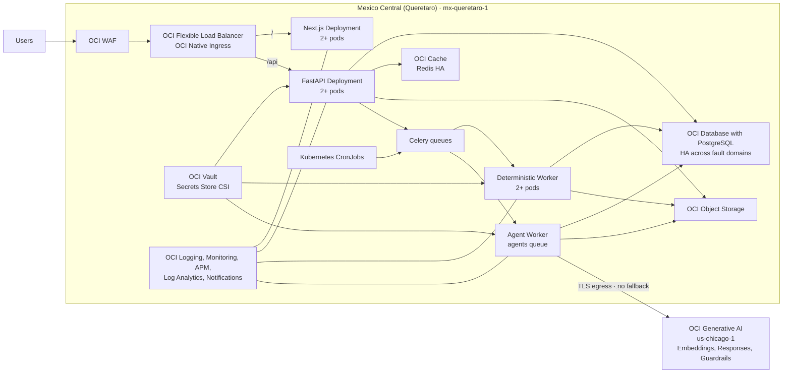

# OCI OKE Horizontal Scale Deployment Plan

**Status:** Planned, not authorized for execution

**Workspace:** OCI DIS Blueprint only

**Target milestone:** M77

**Primary OCI region:** Mexico Central (Queretaro), `mx-queretaro-1` (`QRO`)

**Last reviewed:** 2026-07-25

## Decision

OCI DIS Blueprint is compatible with a horizontally scaled container
architecture, but the current Docker Compose runtime is not yet ready for a
production OKE deployment. No OCI deployment may begin until the application
readiness work and the authorization gates in this document are complete.

This document is a plan, not evidence that OCI resources exist. Resource
availability, quotas, identity, compartment, region, and current tenancy state
must be discovered later through authentication owned exclusively by this
workspace.

## Security Boundary

Tool availability never implies shared authorization. Browser, CLI, SDK, MCP,
and connector capabilities may be common across workspaces, but their sessions,
profiles, cached tenancy state, credentials, permissions, resource selections,
and purposes are workspace-bound.

Before any OCI inspection or mutation:

1. Use only the repository-local
   `.agents/skills/oci-dis-blueprint-oci-operator/SKILL.md`.
2. Authenticate independently for OCI DIS Blueprint.
3. Prove the intended tenancy and region through a harmless read-only query.
4. Treat any identity that cannot demonstrate its workspace binding as
   untrusted.
5. Never copy credentials, OCIDs, policies, Terraform state, or observed
   inventory from another workspace.

No OCI resource creation, update, or deletion is authorized by this plan.

## Current Readiness Assessment

| Area | Current state | Deployment disposition |
|------|---------------|------------------------|
| Next.js web | Standalone production image, non-root runtime, no server-local application state | Compatible with multiple replicas |
| FastAPI | Request state externalized; one Uvicorn process per container with configurable pool bounds | App-side complete; OCI database limit and replica budget remain deployment decisions |
| PostgreSQL | Authoritative relational state and assistant conversations are persisted | Move to managed private PostgreSQL with HA |
| Redis/Celery | Shared broker/result backend, late ACK, worker-loss rejection, bounded visibility/results, prefetch 1, leases, and GenAI counters | Move to managed TLS Redis and validate pod/broker failure recovery |
| Object artifacts | One S3-compatible service owns imports, exports, rate cards, and reports | Point the adapter at OCI Object Storage; never deploy MinIO |
| App knowledge | Packaged complete vectors plus a shared S3-compatible active object, ETag refresh, and hash/version readiness | Add immutable release history and a transactional active-version pointer before production promotion |
| Schedules | One Beat dispatcher; scheduled consumers are Redis-lease owned | Package one dispatcher/CronJob topology and validate lease expiry under pod loss |
| Identity | Local Argon2id accounts, opaque DB sessions, memberships, and read-only API tokens; caller identity headers are overwritten | Add OCI IAM Identity Domains as another verified provider before enterprise production |
| Health | Process liveness plus read-only migration, Object Storage, Redis, and complete App Knowledge readiness | Wire startup/readiness probes and validate managed dependency failures in OKE |
| Observability | Sanitized request JSON, request ID, W3C trace propagation, and OCI provider counters; no exporter/backend exists | Add OpenTelemetry export, OCI dashboards, alarms, synthetics, retention, and cost controls |
| Delivery | Images are built and scanned | Add OCIR publication, signing, IaC, Helm, promotion, and rollback |
| Kubernetes artifacts | None | Blocking: no OKE deployment is currently reproducible |

## Scale-out Invariants

Horizontal scale is accepted only when all of these conditions hold:

- Any web or API request can be served by any healthy replica.
- No request requires load-balancer session affinity.
- Every authoritative record is in PostgreSQL or OCI Object Storage.
- Redis contains coordination, queue, result, and bounded telemetry state only.
- All API and agent replicas resolve exactly the same active knowledge hash.
- A terminated API or worker pod cannot lose or duplicate a governed job.
- Scheduled work has one effective owner.
- Database and Redis connection counts stay inside an explicit global budget.
- Startup and readiness probes never mutate application or infrastructure state.
- A rolling deployment preserves active conversations and pending jobs.
- The App Assistant fails closed if embeddings, synthesis, Guardrails, or
  grounding are unavailable; it never silently changes vector space or returns a
  substitute answer.

## Target OCI Architecture

### Compute and routing

- Use an enhanced OKE cluster with managed node pools and VCN-native pod
  networking.
- Deploy every primary application and observability resource in
  `mx-queretaro-1`.
- Querétaro has one Availability Domain. Spread production node pools, pods, and
  supported managed-service members across its three Fault Domains using
  explicit topology constraints, pod anti-affinity, and capacity validation.
- Do not describe this topology as multi-AD. It protects against a Fault Domain
  failure, not a full regional or Availability Domain outage.
- Use the OCI Native Ingress Controller with one Flexible Load Balancer, TLS
  certificates, and path routing:
  - `/` to the web Service;
  - `/api/*`, `/health`, and `/readiness` to the API Service.
- Keep API and data services private. The public boundary is WAF and the load
  balancer.
- Use HPA for web and API replicas. Use custom queue-age or queue-depth metrics
  for worker scaling.
- Use the OKE Cluster Autoscaler on managed node pools after pod requests and
  limits are measured.

The current application does not require sticky sessions. Authentication
sessions, conversations, and messages are in PostgreSQL; only opaque session
cookies and assistant browser-context identifiers remain client-side.

### Workload topology

| Workload | Initial replicas | Scaling policy | Notes |
|----------|------------------|----------------|-------|
| Web | 2 | HPA on CPU and latency evidence | Stateless standalone Next.js |
| API | 2 | HPA on CPU, memory, latency, and request rate | One Uvicorn process per pod |
| Deterministic worker | 2 | Queue age/depth and CPU | Imports, recalc, BOM, pricing, synthetic jobs |
| Agent worker | 1 minimum, 2 after quota validation | Agents queue age and OCI concurrency | Dedicated `agents` queue |
| Scheduled triggers | One effective owner | Kubernetes CronJobs | Dispatch tasks; do not perform long work inline |
| Alembic migration | One Job per release | Never parallel | Must finish before application rollout |
| Reference seed | Explicit Job | Idempotent, separately authorized | Never run from every pod startup |
| Identity bootstrap | One Job on first install | Idempotent and fail-closed | Creates only the first Admin from a mounted secret; never runs per replica |

### Managed data services

- Use OCI Database with PostgreSQL with at least two nodes for production and
  HA placement across distinct Querétaro Fault Domains where supported.
- Keep the database endpoint private and reachable only from workload subnets.
- Use OCI Cache in non-sharded mode initially, with one primary and two replicas.
  Celery compatibility with sharded Redis must be proven before adopting it.
- Use TLS for PostgreSQL and Redis.
- Use OCI Object Storage for all persisted artifacts. MinIO remains local-only.
- Provision buckets outside the application. Runtime readiness may verify access
  but must never create or alter a bucket.

### Secrets and OCI access

- Store database credentials, Redis credentials, Object Storage credentials when
  still required by the S3 compatibility adapter, and the OCI Generative AI API
  key in OCI Vault.
- Mount file-based secrets through the Secrets Store CSI driver.
- Prefer OKE Workload Identity for OCI services that support it.
- Preserve the current read-only file contract for the Generative AI API key.
- Never place secrets in Helm values, ConfigMaps, image layers, `.env`, logs, or
  Terraform state payloads.
- Use separate Kubernetes ServiceAccounts and least-privilege IAM policies for
  web, API, deterministic worker, agent worker, migrations, identity bootstrap,
  and scheduled jobs.
- Generate the initial local Admin password through the approved release secret
  workflow, store it in OCI Vault, and mount it only into the one-shot bootstrap
  Job. Do not expose it through Terraform state, Helm values, Job arguments, or logs.

## Required Application Changes

### P0 - Production blockers

1. Extend the implemented provider-neutral authentication boundary with OCI IAM:
   - register the application in OCI IAM Identity Domains;
   - implement OIDC login;
   - validate JWT signature, issuer, audience, expiry, and scopes;
   - link the verified issuer/subject to an existing or governed new App user;
   - derive actor ID and App role server-side while preserving local sign-in;
   - keep rejecting externally supplied identity headers at the trusted boundary.
2. Make App knowledge a shared versioned artifact:
   - write immutable manifests to Object Storage;
   - store active version, source hash, model, dimensions, and object reference in
     PostgreSQL;
   - download and validate the active artifact into each pod-local cache;
   - invalidate caches through a version signal;
   - reject readiness if the active hash is unavailable or inconsistent.
3. Establish a database connection budget:
   - run one Uvicorn process per API pod;
   - expose pool size, overflow, timeout, and recycle settings;
   - calculate maximum aggregate connections across API and worker replicas;
   - load-test failover and connection exhaustion.
4. Harden Celery delivery:
   - use late acknowledgement and reject-on-worker-loss where safe;
   - define broker visibility timeout and prefetch policy;
   - make every job idempotent at its persisted job boundary;
   - reconcile orphaned `pending` and `running` jobs;
   - add graceful worker termination.
5. Remove singleton mutations from replica startup:
   - move AgentRun pruning into one scheduled task;
   - replace Beat with CronJobs or enforce one leader;
   - add leases for every scheduled governance process.
6. Make probes safe:
   - liveness checks process health only;
   - readiness checks database migration, Object Storage access, Redis access,
     and active knowledge hash;
   - no health endpoint creates infrastructure or changes data.

### P1 - Operability and resilience

- Emit structured JSON logs with request, job, and AgentRun correlation IDs.
- Instrument HTTP, SQL, Redis, Celery, Object Storage, and OCI inference spans.
- Export service metrics for request latency, status, queue age, job duration,
  provider failures, and knowledge freshness.
- Add timeouts, connection limits, and retry budgets for every dependency.
- Add PodDisruptionBudgets, topology spread constraints, resource
  requests/limits, startup probes, and termination grace periods.
- Add NetworkPolicies and OCI Network Security Groups.
- Add database backups, Object Storage retention/versioning, and a tested
  recovery procedure.

## Infrastructure as Code

Create one versioned infrastructure package for:

- compartments and tagging;
- VCN, regional subnets, route tables, gateways, NSGs, and private DNS;
- enhanced OKE and managed node pools;
- OCI Database with PostgreSQL;
- OCI Cache;
- Object Storage buckets and lifecycle policies;
- Vault, keys, and secret references;
- OCIR repositories and image verification policy;
- Certificates, Flexible Load Balancer, Native Ingress, and WAF;
- Logging, Monitoring, Notifications, alarms, and APM;
- IAM dynamic groups, workload identity policies, and deployment identities.

Terraform or OCI Resource Manager may own OCI resources. Helm owns Kubernetes
application objects. Neither layer may contain live secret material.

## Environment Isolation

Application deployment environments are distinct from the DEV, QA, and PRD
commercial environments modeled inside a project BOM.

Recommended runtime isolation:

- **Development:** non-production compartment and namespace.
- **QA:** non-production compartment; may share a non-production OKE cluster
  initially, but uses a separate namespace, database, Redis scope, bucket
  prefixes, secrets, and identity application.
- **Production:** separate compartment and OKE cluster, with independent database,
  Cache, buckets, Vault secrets, DNS, alarms, and deployment approval.

Production credentials and OCI resource identifiers must never be available to
development or QA workloads.

## CI/CD Contract

1. Execute the existing backend, engine, frontend, migration, OpenAPI, browser,
   dependency, and image-security gates.
2. Build immutable API and web images.
3. Tag images with the Git commit SHA and push them to OCIR.
4. Scan and sign the exact image digests.
5. Render and validate Helm manifests.
6. Run Terraform plan and require review for infrastructure changes.
7. Deploy the Alembic Job and verify migration head.
8. Roll out workers, API, and web by immutable digest.
9. Run readiness and synthetic smoke tests.
10. Promote the same image digests from development to QA and production.
11. Roll back by digest and compatible database contract, never by mutable
    `latest` tags.

## Observability and Alerts

Observability is a production dependency, not a post-deployment enhancement.
The platform must identify failure at the user journey, application, job,
provider, Kubernetes, data, and network layers without requiring container
inspection.

### Telemetry architecture

1. FastAPI, Next.js server code, Celery, and the agent worker emit structured
   logs, metrics, and OpenTelemetry traces.
2. W3C trace context propagates through browser request, web, API, Celery task
   headers, worker steps, database calls, Object Storage, and OCI Generative AI.
3. An OpenTelemetry Collector runs as an OKE Deployment with at least two
   replicas, a PodDisruptionBudget, bounded queues, memory limits, batching,
   retry, and TLS. Telemetry delivery is non-blocking for business requests.
4. OCI Logging receives application, OKE, load-balancer, WAF, and network logs.
   OCI APM receives server traces and synthetic availability evidence. OCI
   Monitoring receives native service metrics and bounded custom metrics.
5. OCI Log Analytics in Querétaro provides cross-source investigation for the
   retained operational and security logs. Service Connector Hub archives the
   approved log classes to Object Storage.
6. OCI Notifications routes alarms by severity. Notification subscriptions and
   escalation ownership are a required operational decision before production.

The Collector must not become an application availability dependency. A
Collector failure creates its own alarm, applies bounded backpressure, and may
drop only telemetry according to a documented policy; it never causes the App
to invent a successful business result.

### Application instrumentation contract

The following signals must be implemented before OCI provisioning is considered
complete:

| Layer | Required signals |
|------|------------------|
| Web | request count, server latency, status class, browser error count, Web Vitals, build digest |
| API | RED metrics, route template, dependency duration, pool wait, timeout, cancellation, build digest |
| Jobs | queue, queue age, execution duration, retry, idempotency rejection, orphan reconciliation, terminal state |
| Agents | run/step duration, evidence-tool result, grounding status, provider request result, Guardrails result, terminal degradation |
| Knowledge | active artifact hash agreement, model, dimensions, vector count, freshness, publication and activation result |
| Data | PostgreSQL pool saturation and failover; Redis latency, memory, evictions and connectivity; Object Storage result and duration |
| Kubernetes | desired/available replicas, restarts, OOM kills, unschedulable pods, HPA ceiling, node pressure and autoscaler result |
| Edge/network | WAF actions, load-balancer status/latency, TLS health, VCN flow evidence, rejected network-policy traffic where observable |

Metrics use route templates and fixed enums, never raw URLs, resource OCIDs,
exception text, or business identifiers. Correlation IDs may appear only in
access-controlled logs and traces; they are forbidden as metric dimensions.

### Provisional OCI resource request

This is the minimum logical request set to validate with the OCI tenancy owner.
Quantities are planning inputs, not evidence that quota or capacity exists.

| Resource | Querétaro request | Isolation and purpose |
|----------|-------------------|-----------------------|
| Observability compartments | 1 non-production, 1 production, 1 security/archive | Separate IAM, budgets, retention, and blast radius |
| APM domains | 2 | One non-production and one production domain |
| OCI Logging log groups | 3 | Non-production, production, and security/platform |
| Custom application logs | 8 logical streams per runtime environment | Web, API, deterministic worker, agent worker, scheduler, migration, ingress/access, security/audit |
| OCI service logs | Enable where supported | OKE control plane, load balancer, WAF, VCN Flow Logs, Object Storage, database and Cache |
| Log Analytics | Enable once in `mx-queretaro-1`; 2 operational groups | Non-production and production/security analysis with least-privilege access |
| Monitoring custom namespace | `oci_dis` per environment | Fixed-cardinality App, job, knowledge, and provider metrics |
| Notifications topics | 3 | Production critical, production warning, and non-production |
| Alarm definitions | Generated by Terraform from the alert matrix | Separate severity, runbook URL, owner, and missing-data behavior |
| Management dashboards | Minimum 4 | Service health, jobs/data, AI/knowledge, and platform/capacity |
| Public Health Checks | Minimum 3 production, 2 non-production | Web, API liveness, and API readiness from multiple vantage points |
| APM synthetic monitors | 3 production journeys | Login/open project, deterministic API read, and App Assistant provider path using synthetic data only |
| Service Connectors | 3 | Non-production logs to archive, production operational logs to archive, security logs to restricted archive |
| Object Storage archive buckets | 2 | Separate non-production and production/security telemetry archives with lifecycle policy |
| Budgets and anomaly alarms | 1 per observability compartment | Detect ingestion, storage, APM, and Logging Analytics cost growth |

During authorized discovery, verify service subscription, quota, endpoint,
shape, and capacity for OKE, PostgreSQL, OCI Cache, APM, Logging Analytics, and
Health Checks in `mx-queretaro-1`. If a listed managed service is unavailable,
stop and produce an explicit architecture decision; do not silently substitute
a self-managed service.

### Alert matrix

Every production alarm must define an owner, severity, evaluation window,
missing-data behavior, notification topic, dashboard, and executable runbook.
Thresholds remain provisional until a seven-day QA load baseline and approved
business SLOs exist.

| Alert family | Required detection |
|--------------|--------------------|
| User availability | Public web/API failure, TLS failure, readiness unavailable, synthetic journey failure |
| API/Web quality | p95/p99 latency, 5xx rate, browser errors, exhausted connection pool, timeout surge |
| Work queue | oldest task age, queue growth, retry storm, worker loss, stuck or terminally failed governed job |
| PostgreSQL | availability, connections, CPU/storage saturation, replication/failover state, backup failure |
| Redis | availability, latency, memory, eviction, connections, broker/result errors |
| Object Storage | access error, artifact publication failure, active knowledge object unavailable |
| App knowledge | stale artifact, activation failure, model/dimension mismatch, provider-vector count mismatch, pod hash disagreement |
| GenAI in Chicago | DNS/TLS/connectivity, latency, `429`, `5xx`, retry exhaustion, Guardrails failure/block, Responses incompatibility, terminal provider degradation |
| OKE | crash loop, OOM kill, unavailable replica, unschedulable pod, node pressure, HPA ceiling, autoscaler failure |
| Edge/security | WAF anomaly, authentication failure surge, forbidden request surge, unexpected public exposure |
| Telemetry | Collector unavailable, exporter backlog/drop, log ingestion gap, alarm delivery failure, unexpected telemetry cost growth |

The App Assistant has no answer fallback. Loss of embeddings, Responses,
Guardrails, grounding, or the Querétaro-to-Chicago path produces a truthful
terminal unavailable state and a critical provider-path signal.

### Data protection, retention, and cost controls

- Never record prompt or answer content, credentials, actor identity, customer
  data, workbook cells, project names, session IDs, or integration IDs in
  metrics.
- Logs and traces use sanitized fixed event names. Approved opaque correlation
  IDs are allowed only for incident investigation and are access-controlled.
- Sample successful traces after the QA baseline; retain 100% of errors and
  abnormal-latency traces within the service's supported policy.
- Production defaults to `INFO`; persistent `DEBUG` logging is forbidden.
- Define per-stream ingestion budgets and alerts before production traffic.
- Archive only approved log classes. Lifecycle, legal hold, and deletion
  settings require data-governance approval.
- Proposed policy targets are 30 days of hot non-production telemetry, 90 days
  of hot production operational telemetry, and 365 days of restricted
  security/audit archive. These are not final until OCI service limits, cost,
  and corporate retention policy are reconciled.

### Observability acceptance criteria

1. One synthetic request can be traced from edge to API, Celery, PostgreSQL,
   Object Storage, and the remote GenAI call where applicable.
2. Log redaction tests prove that prompts, answers, customer data, and secrets
   are absent.
3. Metric-cardinality tests reject raw identifiers and unbounded labels.
4. Controlled API, worker, database, Redis, Collector, and Chicago-provider
   failures create the expected alarms and reach the correct topics.
5. Dashboards identify build digest, region, environment, current SLO state,
   queue health, knowledge hash, and provider-path health.
6. A seven-day QA load run produces an ingestion-volume and monthly-cost
   estimate before production resources are approved.
7. Every alarm links to a tested runbook and has a named operational owner.

## Validation Before Production

Use the retained fictional Aurora reference project as the primary scale and
resilience fixture. Production readiness requires:

1. `350/350` integrations remain `QA = OK`.
2. Four scenario variants retain 100% published BOM coverage.
3. Web and API scale from two replicas without sticky sessions.
4. Killing an API pod during active use causes no user-visible data loss.
5. Killing workers during import, recalc, BOM, and agent execution causes no
   lost or duplicated governed result.
6. Every API and agent pod reports the same active knowledge source hash, model,
   dimensions, and provider vector count.
7. App Assistant evaluations complete in provider space with
   `fallback_used = false`.
8. Embedding, inference, Guardrails, or grounding failure is visible and terminal.
9. PostgreSQL and Redis failover tests complete within the agreed recovery
   objective.
10. A rolling application deployment completes without losing active
    conversations or pending jobs.
11. Every required alarm is triggered through a controlled test and reaches the
    intended notification channel.
12. A rollback restores the prior application digest without corrupting the
    database contract.

## Authorization Gates

The user must explicitly authorize each transition:

1. **Repository readiness:** implement and validate P0/P1 changes locally.
2. **Read-only OCI discovery:** authenticate this workspace and inspect regions,
   quotas, compartments, network, IAM, and existing resources.
3. **Infrastructure plan:** produce Terraform plan and exact cost/security impact.
4. **Non-production mutation:** create only approved development/QA resources.
5. **Production mutation:** separate explicit authorization after non-production
   load, failure, security, backup, and rollback validation.

No earlier gate grants permission for a later gate.

## Regional Decision

The primary application region is **Mexico Central (Queretaro),
`mx-queretaro-1` (`QRO`)**. Its distance from OCI Generative AI is not a reason
to relocate the application.

Querétaro has one Availability Domain. M77 therefore provides in-region high
availability across the three Fault Domains, but it does not claim protection
against a complete region or Availability Domain outage. A secondary disaster
recovery region, replication method, RPO, and RTO require a separate decision
and explicit authorization.

OCI Generative AI is not currently listed as a Querétaro service region. The
governed project, embeddings, Responses, and Guardrails remain in
`us-chicago-1`:

- only the agent worker receives outbound access to the approved OCI GenAI
  endpoints over TLS;
- egress uses the private workload subnet through the governed NAT path and
  restrictive destination policy;
- bounded, redacted evidence may cross regions; prompts and responses are never
  written to telemetry;
- DNS, TLS, latency, throttling, provider availability, and retry exhaustion are
  measured as a remote dependency;
- no alternate model, local embedding space, cached answer, or silent fallback
  is permitted;
- cross-region data processing, egress cost, latency objectives, and contractual
  residency must be approved before production.

Before provisioning, this workspace must authenticate independently and verify
Querétaro subscription, quotas, capacity, service versions, fault-domain
placement, backup capabilities, observability availability, and the outbound
Chicago path. The region itself is no longer an open selection.

## OCI References

- [Kubernetes Engine](https://docs.oracle.com/en-us/iaas/Content/ContEng/)
- [Horizontal Pod Autoscaler](https://docs.oracle.com/en-us/iaas/Content/ContEng/Tasks/contengusinghorizontalpodautoscaler.htm)
- [Cluster Autoscaler](https://docs.oracle.com/en-us/iaas/Content/ContEng/Tasks/contengusingclusterautoscaler.htm)
- [OCI Native Ingress Controller](https://docs.oracle.com/en-us/iaas/Content/ContEng/Tasks/contengsettingupnativeingresscontroller.htm)
- [Managing OKE secrets](https://docs.oracle.com/en-us/iaas/Content/ContEng/Tasks/contengmanagingsecrets.htm)
- [OCI Database with PostgreSQL HA](https://docs.oracle.com/en-us/iaas/Content/postgresql/high-availability.htm)
- [OCI Cache](https://docs.oracle.com/en-us/iaas/Content/ocicache/overview.htm)
- [OCI IAM Identity Domains tokens](https://docs.oracle.com/en-us/iaas/Content/Identity/api-getstarted/SupportedTokens.htm)
- [OCI API Gateway JWT validation](https://docs.oracle.com/en-us/iaas/Content/APIGateway/Tasks/apigatewayusingjwttokens.htm)
- [OCIR image signing](https://docs.oracle.com/en-us/iaas/Content/Registry/Tasks/registrysigningimages_topic.htm)
- [OCI Application Performance Monitoring](https://docs.oracle.com/en-us/iaas/application-performance-monitoring/doc/application-performance-monitoring.html)
- [OCI regions and Availability Domains](https://docs.oracle.com/en-us/iaas/Content/General/Concepts/regions.htm)
- [Highly available applications in a one-AD region](https://docs.oracle.com/en-us/iaas/Content/Resources/Assets/whitepapers/building-ha-apps-in-one-availability-domain.pdf)
- [OCI Generative AI regions](https://docs.oracle.com/en-us/iaas/Content/generative-ai/regions.htm)
- [OCI Log Analytics regional setup](https://docs.oracle.com/en-us/iaas/log-analytics/doc/enable-access-logging-analytics-and-its-resources.html)
- [OCI Health Checks](https://docs.oracle.com/en-us/iaas/Content/HealthChecks/home.htm)
