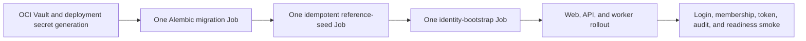

# Installation identity onboarding

This runbook is the authoritative first-install identity flow for a new Docker
host and the future OCI deployment. It creates the initial local administrator
through the same provider-neutral identity and authorization model used by the
App. It does not enable public registration or introduce deployment-only users.

## Security contract

- Run database migrations and reference seeding before identity bootstrap.
- Bootstrap may create exactly one first `Admin`. A retry for the same username
  is a no-op; any different pre-existing user makes the job fail closed.
- Passwords use the normal Argon2id service. Plaintext is never persisted in
  PostgreSQL, audit records, container logs, images, `.env`, or Git.
- A generated password or optional API token must be written to an exclusive
  mode-`0600` file. The raw values are never printed by the bootstrap command.
- An initial API token is optional, read-only, time-bounded, and explicitly
  scoped. It inherits the Admin's live project memberships and should be
  revoked after deployment automation is complete.
- Browser sessions and API tokens are opaque random secrets stored only as
  SHA-256 digests. The App therefore needs no shared JWT/session signing key.
- Database, Redis, Object Storage, OCI GenAI, TLS, and OCI IAM secrets belong to
  the deployment platform. They must be generated or supplied by the installer
  and mounted from a secret store; the App bootstrap never invents OCI keys.

## New Docker host

Start the stack, migrate, and seed as described in the root README. Then create
a host-only credential directory and run the repository-owned one-shot command:

```bash
mkdir -p .local/onboarding
chmod 700 .local/onboarding

docker compose run --rm --no-deps \
  --user "$(id -u):$(id -g)" \
  --volume "$PWD/.local/onboarding:/bootstrap-output" \
  api python scripts/bootstrap_installation.py \
  --username admin \
  --email admin@example.com \
  --display-name "Local Administrator" \
  --generate-password \
  --output-file /bootstrap-output/initial-access.json
```

The generated file is ignored by Git. Read it from the host, sign in, change the
password from **Account**, and securely delete or transfer the file according to
the operator's credential-handling policy. Additional users are created in
**User Management**. The repository CLI remains available as a recovery path:

```bash
docker compose exec api python scripts/manage_local_user.py \
  --username recovery-admin \
  --email recovery-admin@example.com \
  --display-name "Recovery Administrator" \
  --role Admin
```

That recovery command is not part of the automatic first-install path and must
be controlled as a privileged operator action.

### Optional deployment API token

Only request a token when automation must query the API before a human signs in.
Every scope is explicit; omitted scopes default to `projects:read`.

```bash
docker compose run --rm --no-deps \
  --user "$(id -u):$(id -g)" \
  --volume "$PWD/.local/onboarding:/bootstrap-output" \
  api python scripts/bootstrap_installation.py \
  --username admin \
  --email admin@example.com \
  --display-name "Local Administrator" \
  --generate-password \
  --create-api-token \
  --api-token-scope projects:read \
  --api-token-scope integrations:read \
  --api-token-days 7 \
  --output-file /bootstrap-output/initial-access.json
```

The command refuses to overwrite an existing credential file and a bootstrap
retry never creates another token.

## OCI / OKE target flow

OCI rollout remains an M77 future operation. When authorized, the release
pipeline must preserve this order:



The identity-bootstrap Job uses the production API image and this same command.
It reads the initial password from a Secrets Store CSI mounted file:

```bash
python scripts/bootstrap_installation.py \
  --username "$BOOTSTRAP_ADMIN_USERNAME" \
  --email "$BOOTSTRAP_ADMIN_EMAIL" \
  --display-name "$BOOTSTRAP_ADMIN_DISPLAY_NAME" \
  --password-file /run/secrets/oci-dis/bootstrap-admin-password
```

The deployment orchestrator generates the initial password and places it in OCI
Vault through an approved secret-delivery workflow before the Job starts. Do not
put the value in Terraform variables/state, Helm values, a ConfigMap, an OCI
Resource Manager log, or Job arguments. An initial API token is disabled by
default in OCI; if a specific automation requires one, write its one-time output
to an approved secret sink and revoke it immediately after the smoke workflow.

## Acceptance evidence

1. Migration and reference seed Jobs finish once.
2. Exactly one active Admin and one local identity exist after first bootstrap.
3. The password authenticates and its plaintext is absent from database and logs.
4. A second identical bootstrap returns a no-op and does not rotate credentials.
5. A different username on an initialized database fails.
6. Any initial API token is read-only, scope-limited, expiring, auditable, and
   revoked after use.
7. The Admin creates the remaining users and memberships through User Management.
8. Secure-cookie, origin, project-isolation, readiness, and audit smokes pass
   before the release is promoted.
