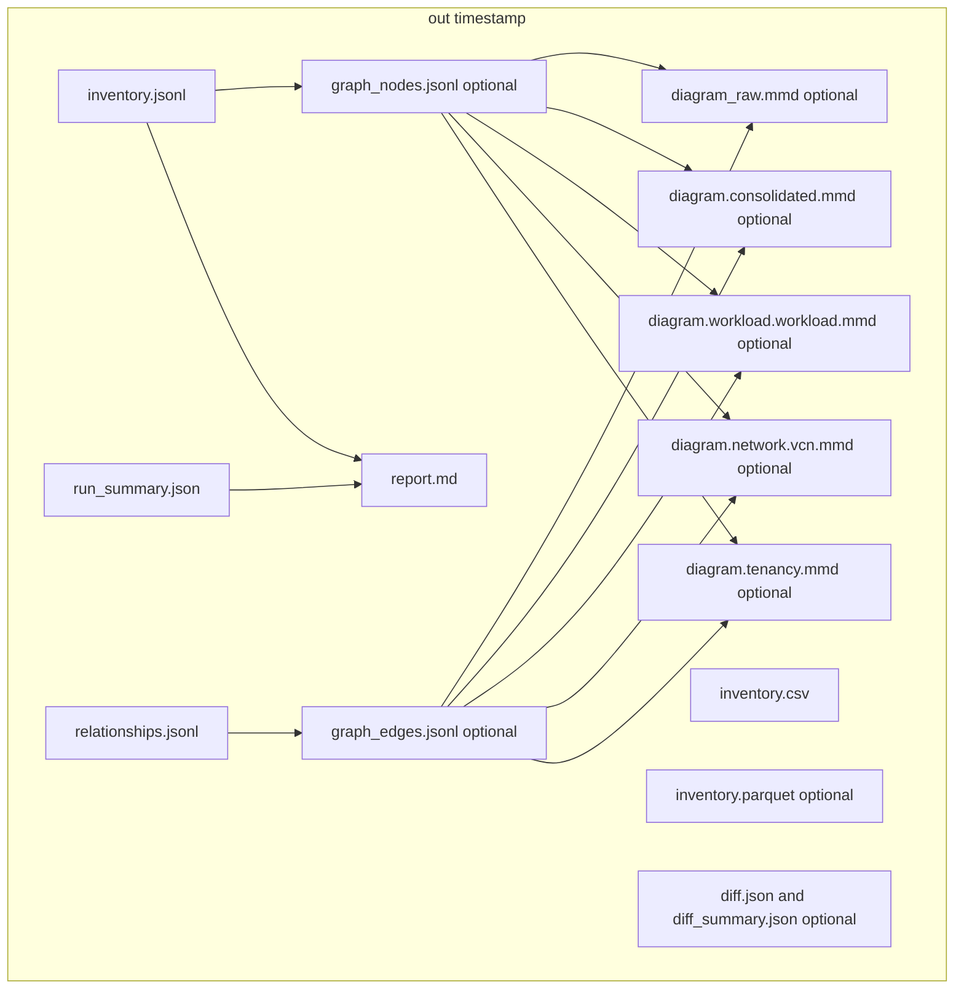

# OCI Inventory
Production-ready Python CLI to inventory Oracle Cloud Infrastructure (OCI) resources using Resource Search, with an enrichment framework, deterministic exports, and diffs.

Phase 1 implements:
- Tenancy-wide discovery using Resource Search (Structured Search) with default query: "query all resources"
- Enricher registry + DefaultEnricher with per-service metadata enrichers for supported resource types
- Exports: JSONL (default) and CSV; Parquet optional via pyarrow
- Optional graph + diagram projections (Mermaid flowchart + consolidated architecture-beta)
- Diffs and stable hashing (excluding collectedAt)
- Coverage metrics and schema validation
- Tests, docs, CI (ruff + pytest)

Repository scope for this package is strictly local under this directory.

## How it works (pipeline)
The CLI runs a deterministic, read-only pipeline and writes a timestamped output folder.

```mermaid
flowchart LR
  A[Auth resolved] --> B[Discover subscribed regions]
  B --> C[Structured Search per region]
  C --> D[Normalize records]
  D --> E[Enrich records + relationships]
  E --> F[Derive metadata relationships]
  F --> G[Write inventory.jsonl inventory.csv parquet]
  G --> H[Write run_summary.json]
  H --> I[Build graph nodes and edges optional]
  I --> J[Write diagram projections optional]
  J --> K[Validate out timestamp schema]
  K --> L[Validate diagrams if enabled]
  L --> M[Optional diff if prev]
  M --> N[Write report.md always]
```



Key guarantees:
- Read-only OCI calls only (list/search/get).
- Stable ordering and hashing for reproducible diffs.
- Report is always written, even if the run fails.
- Schema validation is enforced; validation errors fail the run.

## Install
- Python 3.11+
- Recommended in a virtualenv

```
pip install -U pip
pip install .
# Optional Parquet support
pip install .[parquet]
```

## Preflight setup
Use the preflight script to prepare a local or CI environment (macOS/Linux, no sudo required). It:
- Verifies prerequisites (python3 ≥ 3.11, pip, git; oci CLI is optional and opt-in)
- Creates or reuses a .venv virtual environment and upgrades pip/setuptools/wheel
- Installs the project in editable mode, respecting pyproject.toml
- Supports optional extras via INVENTORY_EXTRAS (e.g., parquet)
- Uses network access for pip upgrades and dependency installs (and OCI CLI if enabled)

Run:
```
./preflight.sh
```

With extras:
```
INVENTORY_EXTRAS=parquet ./preflight.sh
INVENTORY_EXTRAS=parquet,dev ./preflight.sh
```

Install OCI CLI (opt-in):
```
OCI_INV_INSTALL_OCI_CLI=1 ./preflight.sh
```

Offline mode (skip network actions; requires deps already available):
```
OCI_INV_OFFLINE=1 ./preflight.sh
```

Next steps after running:
- Activate: `. .venv/bin/activate`
- Show CLI help: `oci-inv --help`

Common failure modes:
- Python version too low (< 3.11) — install Python 3.11+ and re-run
- Missing pip for python3 — try: `python3 -m ensurepip --upgrade`
- Missing git — install git for your OS

## CLI
Entrypoint: `oci-inv`

Quick help:
```
oci-inv --help
oci-inv <subcommand> --help
```

Commands:
- Run inventory:
  ```
  oci-inv run --outdir out --auth auto --profile DEFAULT --parquet --prev out/20240101T000000Z/inventory.jsonl \
              --workers-region 6 --workers-enrich 24 \
              --query "query all resources"
  ```
- Diff two inventories:
  ```
  oci-inv diff --prev out/prev-run/inventory.jsonl --curr out/curr-run/inventory.jsonl --outdir out/diff
  ```
- Validate authentication:
  ```
  oci-inv validate-auth --auth auto --profile DEFAULT
  ```
- List subscribed regions:
  ```
  oci-inv list-regions --auth auto --profile DEFAULT
  ```
- List compartments:
  ```
  oci-inv list-compartments --auth auto --profile DEFAULT --tenancy ocid1.tenancy.oc1..xxxx
  ```
- List GenAI models:
  ```
  oci-inv list-genai-models
  ```

## Common Use Cases (Copy/Paste)

These examples focus on day-to-day workflows a cloud architect typically needs: tenancy-wide snapshots, scoped inventories (region/compartment/type), repeatable diffs, and auth validation.

### 1) Validate auth + discover subscribed regions

Use this first to confirm credentials and see what regions the tool will query by default.

```
oci-inv validate-auth --auth auto --profile DEFAULT
oci-inv list-regions --auth auto --profile DEFAULT
```

### 2) Tenancy-wide inventory (all subscribed regions)

This is the canonical baseline snapshot.

```
oci-inv run --auth auto --profile DEFAULT --outdir out --query "query all resources"
```

### 3) Inventory in a single region (limit blast radius)

Useful for troubleshooting, performance checks, and focused reviews.

```
oci-inv run --auth auto --profile DEFAULT --regions mx-queretaro-1 --outdir out --query "query all resources"
```

### 4) Inventory a specific compartment (by OCID)

OCI Resource Search filtering is OCID-based for compartments. First, list compartments to find the OCID for the target compartment name:

```
oci-inv list-compartments --auth auto --profile DEFAULT --tenancy ocid1.tenancy.oc1..xxxx
```

Then run a compartment-scoped search:

```
oci-inv run --auth auto --profile DEFAULT --regions mx-queretaro-1 --outdir out \
  --query "query all resources where compartmentId = 'ocid1.compartment.oc1..xxxx'"
```

### 5) Inventory a resource type (tenancy-wide or compartment-scoped)

Common examples: instances, VCNs, subnets, vaults, secrets.

Tenancy-wide (all subscribed regions):

```
oci-inv run --auth auto --profile DEFAULT --outdir out \
  --query "query all resources where resourceType = 'Instance'"
```

Compartment + type + region:

```
oci-inv run --auth auto --profile DEFAULT --regions mx-queretaro-1 --outdir out \
  --query "query all resources where compartmentId = 'ocid1.compartment.oc1..xxxx' and resourceType = 'Vcn'"
```

### 6) Produce a diff between two inventories

Option A: Run a new inventory and diff against a previous `inventory.jsonl` in one command:

```
oci-inv run --auth auto --profile DEFAULT --outdir out \
  --prev out/prev-run/inventory.jsonl \
  --query "query all resources"
```

Option B: Diff any two saved inventories:

```
oci-inv diff --prev out/prev-run/inventory.jsonl --curr out/curr-run/inventory.jsonl --outdir out/diff
```

### 7) Export formats used in reporting pipelines

JSONL + CSV are always written. Parquet is optional and recommended for analytics.

```
oci-inv run --auth auto --profile DEFAULT --outdir out --parquet --query "query all resources"
```

### Notes

- `--regions` limits execution to a comma-separated list (e.g., `--regions mx-queretaro-1,us-phoenix-1`).
- For consistent diffs, compare `inventory.jsonl` files. The stable hash excludes `collectedAt` by design.
- Queries are OCI Resource Search Structured Search strings. Keep the default query exactly `query all resources` unless you intentionally scope it.
- `--include-terminated` is reserved for future filters and currently has no effect.
- Cost reporting uses the tenancy home region for Usage API calls; if the home region cannot be resolved, Usage API cost collection is skipped and reported.
- `--cost-currency` does not convert amounts; if it differs from the Usage API currency, the report warns and keeps API currency amounts.
- OneSubscription usage requires `--osub-subscription-id` (or `OCI_INV_OSUB_SUBSCRIPTION_ID`); otherwise it is skipped.

Flags and config precedence: defaults < config file < environment < CLI  
- Default search query: "query all resources" (MUST)
- Workers defaults: regions=6, enrich=24
- Output: creates a timestamped directory under `--outdir` (default `out/TS`) for run
- Boolean flags accept `--no-<flag>` to override config/env (e.g., `--no-parquet`, `--no-json-logs`)
- Limit discovery regions with `--regions` (comma-separated) or `OCI_INV_REGIONS`
- Config files: `--config <path>` supports YAML/JSON and uses the same key names as CLI flags.

## Components and Usage
This section is a quick map of every user-facing component in the CLI, what it does, and a copy/paste example.

- **Inventory run** (core): discover + enrich, always writes JSONL/CSV and report.md; optional Parquet.
  - Example: `oci-inv run --auth config --profile DEFAULT --regions mx-queretaro-1 --outdir out --query "query all resources where compartmentId = '<compartment_ocid>'" --genai-summary`
- **Diff**: compare two inventories; writes diff artifacts into an out directory.
  - Example: `oci-inv diff --prev out/old/inventory.jsonl --curr out/new/inventory.jsonl --outdir out/diff`
- **Auth validation and discovery helpers**: validate credentials and list tenancy-scoped data.
  - Examples: `oci-inv validate-auth --auth auto --profile DEFAULT`; `oci-inv list-regions --auth auto`; `oci-inv list-compartments --auth auto --tenancy <tenancy_ocid>`
- **GenAI model listing**: show OCI GenAI models and capabilities in CSV format.
  - Example: `oci-inv list-genai-models`
  - Config precedence: `OCI_INV_GENAI_CONFIG` env → `~/.config/oci-inv/genai.yaml` → `.local/genai.yaml`
- **GenAI chat (one-off prompt tester)**: send a prompt using the configured GenAI endpoint/model; redacts OCIDs/URLs in requests/responses.
  - Example: `oci-inv genai-chat --message "Summarize the latest inventory run"`
  - Flags: `--api-format [AUTO|GENERIC|COHERE]`, `--report <report.md>`, `--max-tokens`, `--temperature`
  - Config precedence: `OCI_INV_GENAI_CONFIG` env → `~/.config/oci-inv/genai.yaml` → `.local/genai.yaml` (gitignored). Missing config disables GenAI features gracefully.
- **GenAI report summary**: optional second pass during `run` that appends an executive summary into report.md using the run’s own findings as context.
  - Enable with `--genai-summary` on `run`. If GenAI fails, report.md is still written with an error note.
- **Cost report (optional)**: uses Usage API (home region) for totals and optional OneSubscription usage when `--osub-subscription-id` is provided; writes `cost_report.md`.
  - Enable with `--cost-report` on `run`.
  - Example (no diagrams): `oci-inv run --no-diagrams --cost-report --cost-start 2026-01-01T00:00:00Z --cost-end 2026-01-31T00:00:00Z --cost-currency USD`
  - Example (OneSubscription): `oci-inv run --cost-report --osub-subscription-id <subscription_id> --cost-start 2026-01-01T00:00:00Z --cost-end 2026-01-31T00:00:00Z --cost-currency USD`
  - Data model: Cost Management → Cost Analysis via `UsageapiClient.request_summarized_usages`. This reflects tenancy cost/usage and does not read Subscription Usage or Universal Credits usage.
  - Aggregation: `_extract_usage_amount` reads `computed_amount/cost/amount` from each Usage API item; `_request_summarized_usages` sums values per group (service, compartmentId, region, or total). `total_cost` is the sum across all buckets for the time range.
  - Default granularity is DAILY; time range inputs are normalized to 00:00:00 UTC before querying.
  - Default time range is month-to-date (first day of the current month at 00:00 UTC through now, normalized to 00:00 UTC).
  - Optional compartment grouping: `--cost-compartment-group-by [compartmentId|compartmentName|compartmentPath]` (defaults to compartmentId).
  - `cost_usage_items.csv` includes non-zero Usage API rows (service, time window, amount, currency) for quick validation.
- **Enrichment coverage**: reports which resource types in an inventory lack enrichers.
  - Example: `oci-inv enrich-coverage --inventory out/<timestamp>/inventory.jsonl --top 10`
- **Interactive wizard (optional)**: guided, preview-first UX that builds/executes the same `oci-inv` commands; safe defaults and copy/pasteable outputs.
  - Install extra: `pip install .[wizard]`
  - Run: `oci-inv-wizard`
  - Main modes: run, diff, troubleshooting
  - Troubleshooting includes: validate-auth, list-regions, list-compartments, enrich-coverage, list-genai-models, genai-chat
  - Advanced run options: diagram generation/validation, cost report inputs (including OneSubscription subscription ID), assessment metadata
  - Can save reusable wizard plan files (YAML/JSON) from the interactive flow
- **Outputs**: deterministic artifacts per run under `out/<timestamp>/` (JSONL, CSV, optional Parquet, report.md, graph files, optional diff files when `--prev` is provided).
  - Hashing excludes `collectedAt` to keep diffs stable.

Notes for developers:
- The CLI is read-only; all SDK calls are list/get style. No mutations are performed.
- Region failures are tolerated and captured in report.md; GenAI is optional and isolated from the main run.
- For parquet support, install with extras: `INVENTORY_EXTRAS=parquet ./preflight.sh`.
- Mermaid diagrams are generated as `.mmd` files unless `--no-diagrams` is set. If `mmdc` (Mermaid CLI) is installed,
  `oci-inv run` will validate all `diagram*.mmd` artifacts automatically and fail the run on invalid Mermaid.
  To require validation even when `mmdc` may not be present, use `--validate-diagrams`.
  (During installation you may see npm warnings about Puppeteer deprecations; those are typically non-fatal.)
- When `--validate-diagrams` is set and `mmdc` is missing, the run fails early.
- Diagram and report rules are documented in `docs/diagram_guidelines.md` and `docs/report_guidelines.md`.

## Known Issues and Notes

- Zero-cost `cost_report.md` outputs can occur when the Usage API returns no data for the specified range. Use a full-day UTC range aligned to the Cost Analysis console, set `--cost-end` to the next day (end is effectively exclusive), and confirm the tenancy home region is correct.
- Large ranges can still time out; shorten the range or split it into smaller windows when validating data.

## Output flow (artifacts and consumers)


## Output Contract
Each run writes to: `out/<timestamp>/`
- report.md (execution steps, exclusions, findings, and optional GenAI summary)
- inventory.jsonl (canonicalized, stable JSON lines)
- inventory.csv (report fields)
- inventory.parquet (optional; pyarrow required)
- relationships.jsonl (always written; may be empty)
- graph_nodes.jsonl (diagram-ready nodes; optional)
- graph_edges.jsonl (diagram-ready edges; optional)
- diagram_raw.mmd (Mermaid diagram; raw graph; optional)
- diagram.tenancy.mmd (Mermaid diagram; tenancy/compartment view; optional)
- diagram.network.<vcn>.mmd (Mermaid diagram; per-VCN topology view; optional)
- diagram.workload.<workload>.mmd (Mermaid diagram; workload/application view; optional)
- diagram.consolidated.mmd (Mermaid architecture-beta diagram; all projections consolidated, edges are unlabelled by design; optional)
- diff.json + diff_summary.json (when --prev provided)
- run_summary.json (coverage metrics)

Quick reference (artifacts → purpose):
- report.md: human-readable run log + findings; holds GenAI summary when enabled.
- inventory.jsonl: canonical per-resource records for downstream processing/diffing.
- inventory.csv: tabular view aligned to report fields.
- inventory.parquet: analytics-friendly columnar export (requires parquet extras).
- relationships.jsonl: relationship edges from enrichers + derived metadata.
- graph_nodes.jsonl / graph_edges.jsonl / diagram_raw.mmd: raw topology outputs (optional).
- diagram.*.mmd: architecture-focused projected views (optional).
- diff.json / diff_summary.json: change set when `--prev` is used.
- run_summary.json: coverage/metrics snapshot for automation.

JSONL stability notes:
- Keys sorted; deterministic line ordering by ocid then resourceType
- Hash excludes `collectedAt` to enable meaningful diffs
- `collectedAt` is set per run (run start time) for consistency across records

Schema validation:
- Every run validates `inventory.jsonl`, `relationships.jsonl`, and `run_summary.json`.
- Graph artifacts (`graph_nodes.jsonl`, `graph_edges.jsonl`) are validated when diagrams are enabled.
- Validation warnings are logged; validation errors fail the run.

## Enrichment
Enrichers use **read-only** OCI SDK calls to fetch full metadata for supported resource types.
Metadata is stored under `details.metadata` as the SDK `to_dict()` output, with sensitive fields
redacted by key substring (e.g., private_key, passphrase, password, secret, token, ssh, content).
For resource types without a registered enricher, DefaultEnricher returns `NOT_IMPLEMENTED` and
stores the raw search summary under `details.searchSummary`.

Supported resource types (current metadata enrichers):
- Compute: Instance, Image, BootVolume, BlockVolume, InstanceConfiguration, InstancePool
- Networking: Vcn, Subnet, Vnic, NetworkSecurityGroup, SecurityList, RouteTable, InternetGateway, NatGateway, ServiceGateway, Drg, DrgAttachment, IPSecConnection, IpSecConnection, VirtualCircuit, Cpe, LocalPeeringGateway, RemotePeeringConnection, CrossConnect, CrossConnectGroup, DhcpOptions, DHCPOptions, PrivateIp
- Block Storage: Volume, PublicIp, LoadBalancer
- Identity: Policy
- DNS: DnsZone, CustomerDnsZone, DnsResolver, DnsView
- Object Storage: Bucket
- Logging: LogGroup
- Log Analytics: LogAnalyticsEntity
- Media Services: MediaWorkflow, MediaAsset, StreamCdnConfig, StreamDistributionChannel, StreamPackagingConfig
- Security: Bastion, Vault, Secret, CloudGuardTarget, NetworkFirewall, NetworkFirewallPolicy, WebAppFirewall, WebAppFirewallPolicy

## Auth
Supported methods:
- auto (default): Resource Principals -> Instance Principals -> Config file
- config: `~/.oci/config` profile
- instance: Instance Principals
- resource: Resource Principals
- security_token: session profile via config

Do not print or commit secrets. See docs/auth.md for guidance.

Common flags:
- `--auth [auto|config|instance|resource|security_token]`
- `--profile PROFILE` (config-file auth)
- `--tenancy OCID` (some calls require explicit tenancy OCID when not available from config)

## Environment Variables
- OCI_INV_QUERY
- OCI_INV_OUTDIR
- OCI_INV_PREV
- OCI_INV_CURR
- OCI_INV_PARQUET
- OCI_INV_INCLUDE_TERMINATED
- OCI_INV_JSON_LOGS
- OCI_INV_LOG_LEVEL (INFO, DEBUG, ...)
- OCI_INV_WORKERS_REGION
- OCI_INV_WORKERS_ENRICH
- OCI_INV_REGIONS
- OCI_INV_GENAI_SUMMARY
- OCI_INV_VALIDATE_DIAGRAMS
- OCI_INV_DIAGRAMS
- OCI_INV_COST_REPORT
- OCI_INV_COST_START
- OCI_INV_COST_END
- OCI_INV_COST_CURRENCY
- OCI_INV_COST_COMPARTMENT_GROUP_BY
- OCI_INV_OSUB_SUBSCRIPTION_ID
- OCI_INV_AUTH
- OCI_INV_PROFILE
- OCI_TENANCY_OCID
- OCI_INV_GENAI_CONFIG (GenAI config path)

## Logging
- Std logging, INFO by default
- Structured JSON logs toggled with `--json-logs` or `OCI_INV_JSON_LOGS=1`

## Development
- Linting: ruff
- Tests: pytest
- Build backend: hatchling

Run locally:
```
pip install -e .[parquet]
pip install ruff pytest
ruff check .
pytest
```

## Interactive Wizard (Optional)

If you prefer a guided, preview-first UX with safer defaults, install the optional wizard extra and run:

```
pip install .[wizard]
oci-inv-wizard
```

What it does:
- Walks you through run/diff options, shows the exact `oci-inv` command before execution.
- Writes the same outputs as the CLI (`out/<timestamp>/`), so artifacts remain consistent.
- Supports plan files for non-interactive use (see below for an example).
- Covers all CLI modes, with advanced run options for diagram validation, cost reporting, and assessments.
- Lets you save interactive runs as plan files for reproducible execution.

## GenAI Configuration

GenAI features are available today for `genai-chat`, `list-genai-models`, and `--genai-summary`. The tool redacts OCIDs/URLs in prompts and responses; if GenAI is misconfigured, main runs still complete and record the failure in report.md.

Config precedence (first found wins):
- `OCI_INV_GENAI_CONFIG` (env path)
- `~/.config/oci-inv/genai.yaml`
- `inventory/.local/genai.yaml` (gitignored; for local dev only)

Sample local setup (do not commit real values):

```
mkdir -p ~/.config/oci-inv
cp inventory/.local/genai.yaml ~/.config/oci-inv/genai.yaml
chmod 600 ~/.config/oci-inv/genai.yaml
```

Non-interactive usage (scriptable) is supported via a plan file:

```
cat > wizard-run.yaml <<'YAML'
mode: run
auth: config
profile: DEFAULT
log_level: INFO
json_logs: false
outdir: out
regions: [mx-queretaro-1]
query: "query all resources"
parquet: false
workers_region: 6
workers_enrich: 24
YAML

oci-inv-wizard --from wizard-run.yaml --dry-run
oci-inv-wizard --from wizard-run.yaml --yes
```

## Docs
- docs/quickstart.md: minimal getting started
- docs/architecture.md: layout and design
- docs/auth.md: authentication options and safety
- docs/cost_guidelines.md: cost reporting rules and constraints
- docs/diagram_guidelines.md: diagram rules and OCI-aligned abstraction
- docs/report_guidelines.md: report structure and content rules
- docs/planned.md: planned workstreams and roadmap
- docs/goals.md: project goals and scope guardrails

## License
Apache-2.0 (see LICENSE)
